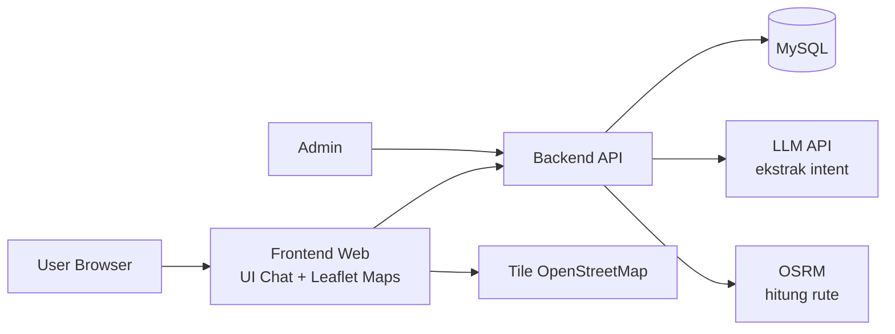
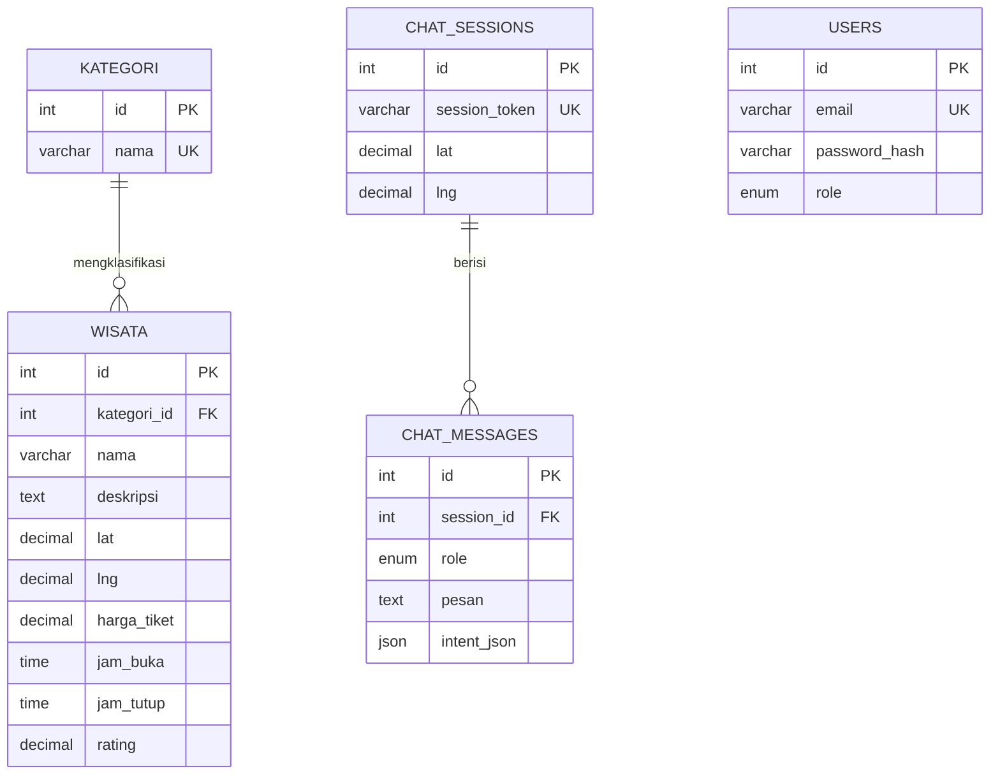

# Desain Sistem — Fase 1

Sistem Pariwisata Kota Padang dengan Chatbot AI Rekomendasi berbasis SQL.

## 1. Arsitektur Sistem



Alur percakapan (core system):

```
1. User buka app → izin GPS → lokasi disimpan di chat_sessions
2. User chat: "mau ke pantai"
3. Backend kirim pesan ke LLM → balas JSON: intent + filter (kategori, radius)
4. Backend query SQL: wisata terdekat, buka hari itu, urut jarak
5. Backend minta rute ke OSRM: jalur + estimasi waktu
6. Backend kirim hasil data ke LLM → "jawab HANYA dari data ini"
7. Chatbot jawab user: rekomendasi + rute di maps
8. Semua pesan tersimpan di chat_messages
```

Prinsip grounding: LLM hanya penerjemah intent dan perangkai kalimat. Semua fakta (nama, jarak, harga, jam) wajib dari hasil query SQL.

## 2. ERD



## 3. Penjelasan Tabel

| Tabel | Peran | Fase |
|---|---|---|
| `kategori` | Klasifikasi wisata: pantai, pulau, museum, alam, kuliner, sejarah | 1 |
| `wisata` | Master data destinasi: lokasi, harga, jam buka, rating | 1 |
| `users` | Akun admin (kelola data lewat admin panel) | 1 |
| `chat_sessions` | Sesi percakapan + posisi user (acuan hitung jarak) | 1 |
| `chat_messages` | Riwayat chat; `intent_json` menyimpan hasil ekstrak LLM — jadi data evaluasi akurasi untuk jurnal | 1 |
| `ulasan` | Ulasan pengguna → bahan personalisasi | 2 |

## 4. Query Inti: Wisata Terdekat (Haversine)

Dasar rekomendasi location-aware. Parameter: posisi user (lat/lng), kategori, radius km.

```sql
SELECT id, nama, lat, lng, harga_tiket, jam_buka, jam_tutup, rating,
       (6371 * ACOS(
         COS(RADIANS(:user_lat)) * COS(RADIANS(lat)) *
         COS(RADIANS(lng) - RADIANS(:user_lng)) +
         SIN(RADIANS(:user_lat)) * SIN(RADIANS(lat))
       )) AS jarak_km
FROM wisata
WHERE status_aktif = 1
  AND kategori_id = :kategori_id
HAVING jarak_km <= :radius_km
ORDER BY jarak_km ASC
LIMIT 5;
```

Rekomendasi akhir bisa diprioritaskan: gabung `jarak_km` + `rating` (mis. skor = rating / jarak_km).

## 5. File Pendamping

- `database.sql` — DDL MySQL siap jalan + seed kategori + contoh data (koordinat contoh, wajib diganti data asli dari OpenStreetMap).
