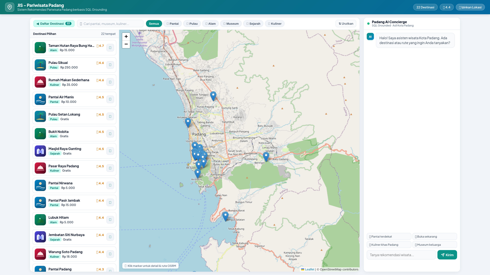
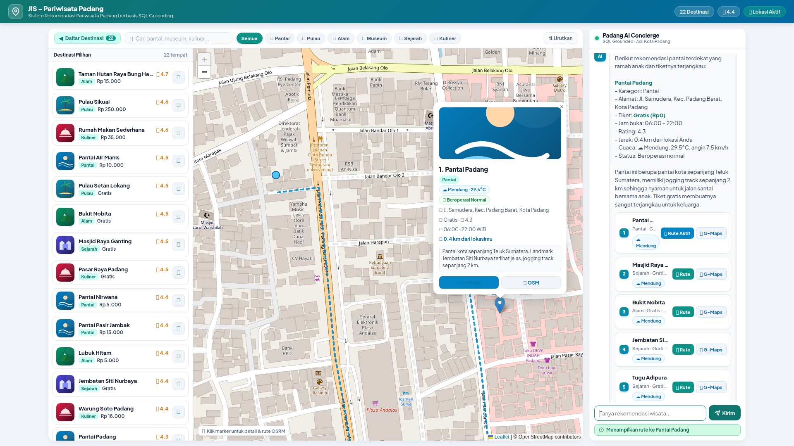
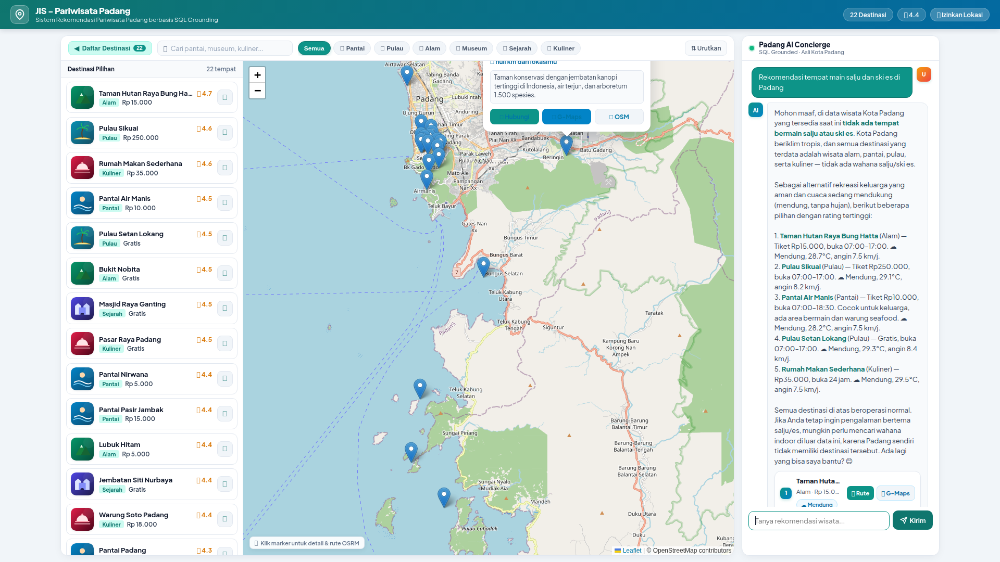

# Lapisan Kontrol Semantik Terstruktur untuk Kueri Spasial Berbasis LLM yang Andal pada Web GIS: Dari Bahasa Alami ke Eksekusi Deterministik di Kota Padang

**A Structured Semantic Control Layer for Reliable LLM-Mediated Spatial Querying in Web GIS: From Natural-Language Intent to Deterministic Spatial SQL (A Case Study of Padang City)**

---

## ABSTRAK

Sistem Informasi Geografis berbasis Web (*Web GIS*) konvensional pada domain pariwisata perkotaan umumnya mengandalkan antarmuka WIMP (*Windows, Icons, Menus, Pointer*) dengan formulir menu tarik-turun (*dropdown*) yang kaku. Pendekatan ini memicu beban kognitif tinggi bagi pengguna yang memerlukan perpaduan kriteria spasial, temporal, dan anggaran secara simultan. Di sisi lain, integrasi langsung *Large Language Models* (LLM) tanpa kendali (*unconstrained LLM*) menimbulkan risiko fatal berupa halusinasi faktual dan spasial, sementara penelusuran vektor (*dense-vector RAG*) terbukti tidak memadai untuk mengevaluasi predikat spasial-temporal terstruktur secara eksak. Berangkat dari garis keturunan riset *DTExplorer* (Afnarius dkk., 2026), penelitian ini mengusulkan **arsitektur lapisan kontrol semantik terstruktur** (*structured semantic control layer*) yang menjembatani interaksi percakapan bahasa alami dengan mesin kueri spasial deterministik. Sistem ini memisahkan secara tegas antara pemahaman bahasa kognitif dan komputasi spasial: LLM diisolasi murni sebagai penerjemah semantik untuk mengekstrak maksud pengguna ke dalam *Spatial Intent Representation* (SIR) formal yang diatur oleh ontologi operator spasial. SIR tersebut divalidasi melalui algoritma *SIR Validator* bertingkat enam dimensi (skema, tipe, domain, operator, entitas, dan konsistensi batasan) guna menegakkan invarian keamanan, lalu dikompilasi oleh *Deterministic Spatial Query Compiler* menjadi SQL terparameterisasi berbasis formula *Haversine* pada PostgreSQL, terintegrasi dengan *Open Source Routing Machine* (OSRM) dan antarmuka peta Leaflet.js. Pengujian empiris terhadap 40 skenario percakapan *benchmark* terstandarisasi pada 22 destinasi wisata Kota Padang menunjukkan akurasi ekstraksi SIR sebesar **100,00%** (40/40), presisi eksekusi predikat spasial sebesar **97,50%** (39/40), *Entity Fabrication Rate* **0,00%** (0 objek wisata palsu), *Grounding Fidelity* **100,00%**, serta *Honest Rejection Rate* **100,00%** pada permintaan di luar yurisdiksi. Waktu respons ujung-ke-ujung rata-rata tercatat **1.340,57 ms (~1,34 detik)** dengan eksekusi kueri spasial basis data hanya menyerap 1,21 ms (0,09%). Temuan ini membuktikan bahwa pembatasan kewenangan LLM melalui representasi semantik perantara terstruktur mampu menghadirkan antarmuka percakapan yang luwes sekaligus menjamin keandalan faktual mutlak bagi sistem informasi spasial perkotaan.

**Kata Kunci:** *Intelligent Spatial Information System, Spatial Intent Representation (SIR), SIR Validator, Strict Grounding Contract, Deterministic Spatial Query Compiler, Web GIS, Formula Haversine, Kota Padang.*

---

## ABSTRACT

Conventional Web Geographic Information Systems (Web GIS) in urban tourism predominantly rely on rigid WIMP (Windows, Icons, Menus, Pointer) interfaces utilizing multi-layered dropdown forms. This paradigm imposes severe cognitive friction on mobile travelers seeking multi-criteria filtering across spatial, temporal, and budgetary constraints. Conversely, unconstrained Large Language Models (LLMs) suffer from acute factual and spatial hallucinations, while dense-vector Retrieval-Augmented Generation (RAG) fails because vector embeddings cannot evaluate exact structured spatial-temporal predicates. Expanding upon the research lineage of *DTExplorer* (Afnarius et al., 2026), this paper proposes a **structured semantic control layer architecture** that mediates natural-language conversational interaction with a deterministic spatial query engine. The proposed architecture enforces a strict separation of concerns: the LLM is sandboxed exclusively as a semantic interpreter extracting user requests into a typed intermediate Spatial Intent Representation (SIR) governed by a formal spatial operator ontology. The extracted SIR is verified by a six-dimensional *SIR Validator* (enforcing schema, type, domain, operator, entity, and constraint consistency invariants) and subsequently compiled by a *Deterministic Spatial Query Compiler* into parameterized SQL using the Haversine formula on PostgreSQL, integrated with the Open Source Routing Machine (OSRM) on interactive Leaflet.js maps. Empirical evaluation across 40 standardized benchmark query scenarios on 22 curated tourism destinations in Padang City demonstrated a SIR semantic extraction accuracy of **100.00%** (40/40), a spatial execution predicate precision of **97.50%** (39/40), an Entity Fabrication Rate of **0.00%** (zero fabricated POIs), a Grounding Fidelity of **100.00%**, and an Honest Rejection Rate of **100.00%** on out-of-scope requests. Average end-to-end latency was **1,340.57 ms (~1.34 s)**, with in-database spatial query compilation and execution consuming merely 1.21 ms (0.09%). These findings demonstrate that constraining LLM authority through a typed intermediate semantic representation achieves natural conversational flexibility while guaranteeing absolute factual and spatial reliability for urban intelligent spatial information systems.

**Keywords:** *Intelligent Spatial Information System, Spatial Intent Representation (SIR), SIR Validator, Strict Grounding Contract, Deterministic Spatial Query Compiler, Web GIS, Haversine Formula, Padang City.*

---

## 1. PENDAHULUAN

### 1.1 Latar Belakang dan Konteks Spasial Perkotaan
Sistem Informasi Geografis berbasis Web (*Web GIS*) telah menjadi tulang punggung penyebaran informasi geospasial modern, khususnya pada sektor pariwisata perkotaan (*urban tourism*) [1], [14]. Kota Padang, sebagai ibu kota Provinsi Sumatera Barat dengan luas wilayah administratif 694,96 km², menghadirkan karakteristik bentang alam dan cagar budaya yang sangat heterogen [16], [17]. Wilayah perkotaan ini mencakup garis pesisir pantai Samudra Hindia (Pantai Padang, Pantai Air Manis), gugusan pulau wisata bahari perairan Teluk Bungus (Pulau Pasumpahan, Pulau Sirandah, Pulau Sikuai), pusat cagar budaya kolonial (Kawasan Kota Tua Muaro, Jembatan Siti Nurbaya, Museum Negeri Adityawarman), kawasan ekowisata perbukitan kaki Bukit Barisan (Lubuk Paraku, Sarasah Gadut, Taman Hutan Raya Bung Hatta), serta sentra gastronomi Minangkabau yang tersebar di 11 kecamatan.

Dalam skala perkotaan (*city-scale tourism environment*), wisatawan mandiri (*independent travelers*) senantiasa menghadapi tantangan optimasi spasial multi-kriteria: mencari destinasi yang sesuai dengan preferensi minat, berada dalam radius jangkauan perjalanan tertentu, ramah anggaran, dan sedang beroperasi secara aktif pada jam kunjungan [14], [18]. Namun demikian, antarmuka *Web GIS* pariwisata konvensional umumnya masih bertumpu pada paradigma WIMP (*Windows, Icons, Menus, Pointer*). Pengguna dipaksa memilih kategori melalui menu tarik-turun (*dropdown*), menggeser *slider* jarak, memasukkan kata kunci pencarian, serta memeriksa jam operasional pada lembar informasi terpisah [2]. Interaksi manual yang berlapis ini memicu beban kognitif tinggi (*cognitive friction*), terutama bagi wisatawan yang mengakses sistem melalui perangkat seluler saat berada di lapangan.

### 1.2 Lineage Penelitian: Dari Eksplorasi Statis Menuju Kueri Spasial Berbasis Kecerdasan Buatan
Evolusi sistem pendukung keputusan spasial pariwisata dalam kelompok penelitian ini bertolak dari fondasi empiris yang telah dibangun sebelumnya:
1. **DTExplorer (Afnarius dkk., 2026) [2]:** Memelopori interaksi spasial eksploratori sadar-skala (*scale-aware exploratory spatial interaction*) pada skala mikro pedesaan (*village-level tourism*). *DTExplorer* membuktikan bahwa kurasi data titik minat (*Points of Interest* / POI) berkualitas tinggi dan visualisasi radius radial efektif memandu wisatawan tanpa memerlukan model optimasi komputasi yang membebani peladen.
2. **Kustomrut (Afnarius dkk.):** Mengembangkan interaktivitas rute wisata yang dapat disesuaikan langsung oleh pengguna (*user-controlled itinerary customization*).
3. **Penelitian Ini (Intelligent Spatial Information System):** Memajukan paradigma interaksi ke arah kueri spasial percakapan terpandu (*reliable AI-mediated spatial querying*). Pengguna tidak lagi memanipulasi kontrol formulir yang kaku, melainkan cukup mengekspresikan kebutuhan perjalanan menggunakan bahasa alami (misalnya: *"Carikan pantai yang ombaknya tenang dekat lokasi saya, tiket di bawah 15 ribu dan buka sekarang"*), sementara sistem menerjemahkannya secara deterministik ke dalam operasi basis data spasial tanpa halusinasi.

### 1.3 Keterbatasan Pendekatan yang Ada: Ancaman Halusinasi dan Kegagalan RAG Vektor
Dalam mengintegrasikan model kecerdasan buatan percakapan seperti *Large Language Models* (LLM) ke dalam sistem informasi geospasial, terdapat jebakan metodologis mendasar apabila LLM dihubungkan secara langsung tanpa sekat pembatas (*unconstrained end-to-end LLM*) [3], [5]:
* **Halusinasi Spasial dan Faktual:** LLM bekerja berdasarkan mekanisme probabilistik prediksi token (*next-token prediction*), bukan mesin verifikasi fakta relasional [4], [5]. Akibatnya, LLM rentan menciptakan entitas destinasi fiktif (*fabricated POIs*), memanipulasi jam operasional dan tarif tiket, atau memberikan estimasi jarak geodesik yang mustahil secara geografis.
* **Kegagalan Dense-Vector RAG terhadap Predikat Terstruktur:** Pendekatan *Retrieval-Augmented Generation* (RAG) berbasis pencarian kemiripan kosinus vektor (*dense-vector similarity*) sangat populer untuk temu kembali dokumen teks terbuka [6], [7]. Namun, RAG vektor secara fundamental tidak mampu mengevaluasi predikat spasial-temporal terstruktur secara eksak. Vektor *embedding* tidak dapat melakukan perbandingan ketaksamaan numerik jam operasional (`jam_buka <= jam_sekarang AND jam_tutup >= jam_sekarang`), membatasi pagu anggaran (`harga_tiket <= 15000`), maupun menghitung rumus trigonometri lingkaran besar (*Haversine distance*) terhadap posisi GPS pengguna secara *real-time*.

### 1.4 Rumusan Masalah dan Pemosisian Ilmiah (Scientific Positioning)
Bertolak dari keterbatasan di atas, pusat gravitasi ilmiah penelitian ini bukanlah sekadar *"membangun aplikasi chatbot untuk Web GIS"*, melainkan menjawab pertanyaan mendasar sistem informasi cerdas:
> **Bagaimana merancang lapisan kontrol semantik terstruktur (*structured semantic control layer*) yang mampu memediasi kueri spasial bahasa alami menjadi eksekusi komputasi spasial deterministik pada basis data, sehingga LLM berfungsi optimal sebagai antarmuka kognitif tanpa memiliki kewenangan untuk memanipulasi atau mengarang fakta spasial?**

### 1.5 Kontribusi Ilmiah
Penelitian ini memberikan lima kontribusi ilmiah:
1. **Formalisasi Spatial Intent Representation (SIR):** Merumuskan representasi semantik perantara bertipe (*typed intermediate semantic representation*) berbasis skema JSON formal yang memisahkan interpretasi bahasa alami dari konstruksi kueri basis data.
2. **Ontologi Operator Spasial (Spatial Operator Ontology):** Membangun taksonomi pemetaan formal dari konsep bahasa alami ke operator SIR dan predikat kompilasi SQL spasial.
3. **Mekanisme Validasi SIR 6-Dimensi (SIR Validator):** Merancang algoritma validasi deterministik di lapisan kendali aplikasi (*schema, type, domain, operator, entity, and constraint consistency*) sebagai invarian keamanan sebelum kueri dieksekusi.
4. **Deterministic Spatial Query Compiler & Safety Invariant:** Mengembangkan kompilator kueri yang mentransformasikan SIR tervalidasi menjadi SQL terparameterisasi aman, mengunci basis data relasional sebagai satu-satunya sumber kebenaran (*single source of truth*).
5. **Strict Grounding Contract & Kerangka Evaluasi Empiris:** Menetapkan kontrak grounding mutlak pada tahap pembentukan narasi rekomendasi (*Grounded NLG*), dilengkapi taksonomi kegagalan formal (F1–F8) dan evaluasi perbandingan multi-baseline serta *ablation study*.

---

## 2. LANDASAN TEORETIS DAN FORMALISASI KONSEPTUAL

### 2.1 Prinsip Pemisahan Semantik Kognitif dan Komputasi Spasial
Untuk menjamin integritas data geospasial, penelitian ini menetapkan aksioma arsitektural:
$$\boxed{\text{LLM interprets natural-language semantics; Spatial DBMS computes deterministic spatial relations.}}$$
Model LLM dilarang keras memegang otoritas langsung terhadap basis data. LLM tidak diizinkan membuat teks kueri SQL secara bebas, dilarang menentukan nama tabel atau kolom, dan tidak diperkenankan melakukan komputasi jarak secara internal. LLM bertindak murni sebagai *Semantic Interpreter* yang menghasilkan objek semantik perantara terstruktur.

### 2.2 Ontologi Operator Spasial (Spatial Operator Ontology)
Kueri bahasa alami pengguna ditransformasikan menjadi representasi semantik melalui pemetaan operator ontologis yang terdefinisi secara ketat. Tabel 1 merinci ontologi operator spasial yang diterapkan:

**Tabel 1. Ontologi Operator Spasial pada Sistem Rekomendasi Terstruktur**

| Ekspresi Bahasa Alami | Operator SIR | Operator / Predikat SQL Deterministik | Semantik Operasional |
|---|---|---|---|
| *"paling dekat"*, *"terdekat"* | `nearest` | `ORDER BY distance_km ASC LIMIT k` | Mengurutkan kandidat POI berdasarkan kedekatan geodesik dari titik acuan |
| *"dalam radius 5 km"*, *"sekitar 10 km"* | `within_radius` | `WHERE distance_km <= :radius_km` | Menyaring destinasi di dalam batas radius lingkaran geodesik |
| *"di Kecamatan Padang Selatan"* | `within_admin_area` | `WHERE alamat ILIKE :admin_pattern` | Menyaring destinasi di dalam batas wilayah administratif perkotaan |
| *"buka sekarang"*, *"sedang buka"* | `open_now` | `WHERE :current_time BETWEEN jam_buka AND jam_tutup` | Evaluasi predikat sirkadian waktu operasional aktif |
| *"buka 24 jam"* | `open_24h` | `WHERE jam_buka = '00:00:00' AND jam_tutup >= '23:59:00'` | Menyaring objek wisata beroperasi non-stop |
| *"tiket gratis"*, *"tanpa bayar"* | `is_free` | `WHERE harga_tiket = 0` | Menyaring destinasi publik tanpa tiket retribusi |
| *"tiket maksimal 20 ribu"* | `max_price` | `WHERE harga_tiket <= :max_price` | Membatasi pagu anggaran tiket masuk |
| *"pantai"*, *"museum"*, *"kuliner"* | `category` | `WHERE kategori.nama = :category_name` | Pembatasan relasional terhadap 6 klaster wisata resmi |

### 2.3 Skema Formal Spatial Intent Representation (SIR)
Alih-alih mengandalkan keluaran teks bebas, sistem memformalkan maksud pengguna ke dalam skema data bertipe. Tabel 2 mendefinisikan spesifikasi skema SIR formal:

**Tabel 2. Spesifikasi Skema Formal Spatial Intent Representation (SIR)**

| Atribut SIR | Tipe Data | Deskripsi Semantik | Nilai yang Diizinkan (*Allowed Values*) |
|---|---|---|---|
| `intent` | *Enum* | Maksud utama interaksi | `spatial_recommendation`, `entity_lookup`, `general_inquiry` |
| `entity` | *Enum* | Entitas target yang dicari | `tourism_object` |
| `category` | *Enum* / *Null* | Klaster kategori wisata | `Pantai`, `Pulau`, `Alam`, `Museum`, `Sejarah`, `Kuliner`, `null` |
| `spatial_operator` | *Enum* | Predikat spasial operasi | `nearest`, `within_radius`, `within_admin_area`, `none` |
| `reference_type` | *Enum* | Tipe titik referensi spasial | `gps`, `city_center`, `poi`, `unknown` |
| `distance` | *Float* / *Null* | Nilai ambang batas jarak ($\ge 0$) | Nilai riil positif dalam kilometer (default: 20,0 km) |
| `distance_unit` | *Enum* | Satuan metrik jarak | `km`, `m` |
| `admin_area` | *String* / *Null* | Nama kecamatan/wilayah | String nama wilayah (misal: "Bungus", "Padang Barat") |
| `target_name` | *String* / *Null* | Nama entitas spesifik | String nama POI target untuk *entity lookup* |
| `keyword` | *String* / *Null* | Atribut tekstual deskripsi | String frasa penting (misal: "pasir putih", "air terjun") |
| `is_free` | *Boolean* | Batasan tiket gratis | `true`, `false` |
| `max_price` | *Integer* / *Null*| Batas atas tarif retribusi | Bilangan bulat rupiah $\ge 0$ |
| `open_now` | *Boolean* | Batasan waktu operasional | `true`, `false` |
| `open_24h` | *Boolean* | Batasan operasional 24 jam | `true`, `false` |
| `sort` | *Enum* / *Null* | Kriteria pemeringkatan | `termurah`, `termahal`, `terdekat`, `terbaik`, `null` |
| `is_out_of_scope` | *Boolean* | Penanda kueri di luar domain | `true`, `false` |

Representasi struktural dokumen SIR dalam format JSON dinyatakan sebagai berikut:
```json
{
  "intent": "spatial_recommendation",
  "entity": "tourism_object",
  "category": "Pantai",
  "spatial_operator": "within_radius",
  "reference_type": "gps",
  "distance": 10.0,
  "distance_unit": "km",
  "admin_area": "Padang Selatan",
  "target_name": null,
  "keyword": "pasir putih",
  "is_free": false,
  "max_price": 15000,
  "open_now": true,
  "open_24h": false,
  "sort": "terdekat",
  "is_out_of_scope": false
}
```

### 2.4 Formulasi Komputasi Jarak Geodesik dan Topologi Rute Jaringan Jalan
Sistem membedakan secara tegas antara perhitungan kedekatan spasial linear dengan navigasi jalan raya:

1. **Jarak Geodesik Lingkaran Besar (Formula Haversine):**  
   Diterapkan langsung di dalam kueri SQL PostgreSQL untuk menyaring ribuan baris koordinat secara sub-milidetik. Untuk koordinat pengguna $P_1(\phi_1, \lambda_1)$ dan koordinat objek wisata $P_2(\phi_2, \lambda_2)$ dengan jari-jari bumi $R = 6371\text{ km}$ [12]:
   $$\Delta \phi = \phi_2 - \phi_1, \quad \Delta \lambda = \lambda_2 - \lambda_1$$
   $$a = \sin^2\left(\frac{\Delta \phi}{2}\right) + \cos(\phi_1) \cdot \cos(\phi_2) \cdot \sin^2\left(\frac{\Delta \lambda}{2}\right)$$
   $$c = 2 \cdot \text{atan2}\left(\sqrt{a}, \sqrt{1-a}\right)$$
   $$d_{\text{geodesik}} = R \cdot c$$
   Untuk menjaga stabilitas numerik terhadap *floating-point rounding error*, argumen fungsi dibatasi secara ketat pada interval $[-1.0, 1.0]$.

2. **Jarak dan Geometri Jaringan Jalan (OSRM Engine):**  
   Untuk visualisasi navigasi rute nyata pada peta Leaflet.js, pasangan koordinat dikirimkan ke mesin *Open Source Routing Machine* (OSRM) [9] yang memanfaatkan data jalan OpenStreetMap (OSM) [8] dengan algoritma *Contraction Hierarchies* (CH):
   $$\mathcal{G}_{\text{jalan}} = (V, E, W), \quad \text{Rute}_{\text{opt}} = \arg\min_{p \in \mathcal{P}(P_1, P_2)} \sum_{e \in p} W(e)$$
   Menghasilkan *polyline* lintasan jalan raya perkotaan serta estimasi durasi tempuh kendaraan yang akurat.

---

## 3. METODOLOGI DAN ARSITEKTUR SISTEM

### 3.1 Arsitektur 5-Layer Ilmiah
Arsitektur sistem dirancang ke dalam **lima lapisan hierarkis terpisah** untuk menegakkan kontrol ketat dan membatasi kewenangan kecerdasan buatan:

```
┌─────────────────────────────────────────────────────────────┐
│ 1. CONVERSATIONAL INTERACTION LAYER                         │
│    - Web Client (Leaflet.js + Responsive Chat UI)           │
│    - Session Management & User GPS Coordinate Resolution    │
└──────────────────────────────┬──────────────────────────────┘
                               │ Natural Language + Context
                               ▼
┌─────────────────────────────────────────────────────────────┐
│ 2. LLM SEMANTIC INTERPRETATION LAYER                        │
│    - Cloud LLM Inference Engine                             │
│    - Semantic Slot & Constraint Extraction                  │
│    - Raw Spatial Intent Representation (SIR) Output         │
└──────────────────────────────┬──────────────────────────────┘
                               │ Raw SIR Object
                               ▼
┌─────────────────────────────────────────────────────────────┐
│ 3. SEMANTIC CONTROL & QUERY COMPILATION                     │
│    - SIR Validator (6-Dimensional Invariant Checking)       │
│    - Spatial Operator Ontology Mapping                      │
│    - Deterministic Spatial Query Compiler                   │
└──────────────────────────────┬──────────────────────────────┘
                               │ Validated Parameterized SQL
                               ▼
┌─────────────────────────────────────────────────────────────┐
│ 4. DETERMINISTIC SPATIAL COMPUTATION                        │
│    - Spatial Database: PostgreSQL Relational Engine         │
│    - In-Database Haversine Predicate Evaluation             │
│    - Weather & Operational Status Batch Enrichment          │
└──────────────────────────────┬──────────────────────────────┘
                               │ Factual Spatial Result Set
                               ▼
┌─────────────────────────────────────────────────────────────┐
│ 5. GROUNDED RESPONSE LAYER                                  │
│    - Strict Grounding Contract Enforcement                  │
│    - Intent Preservation & Transparent Fallback Policy      │
│    - Verified Narrative Generation + Leaflet Map Sync       │
└─────────────────────────────────────────────────────────────┘
```

*Gambar 1. Arsitektur 5-Layer Sistem Informasi Spasial Cerdas dengan Pembatasan Kewenangan AI dan Eksekusi Deterministik.*

### 3.2 Kurasi dan Tata Kelola Data Destinasi Wisata
Data primer mencakup 22 objek wisata representatif di Kota Padang yang diverifikasi silang terhadap publikasi resmi Dinas Pariwisata Kota Padang [16] dan Badan Pusat Statistik [17]. Dataset terbagi ke dalam 6 klaster tematik:
1. **Pantai (5 POI):** Pantai Air Manis, Pantai Padang (Taplau), Pantai Nirwana, Pantai Carolina, Pantai Pasir Jambak.
2. **Pulau (3 POI):** Pulau Pasumpahan, Pulau Sirandah, Pulau Sikuai/Pamutusan.
3. **Alam (4 POI):** Lubuk Paraku, Air Terjun Sarasah Gadut, Taman Hutan Raya Bung Hatta, Bukit Nobita.
4. **Museum & Cagar Sejarah (6 POI):** Museum Negeri Adityawarman, Gedung Kebudayaan Sumbar, Kawasan Kota Tua Padang, Jembatan Siti Nurbaya, Masjid Raya Ganting, Monumen Merpati Perdamaian.
5. **Kuliner Minangkabau (4 POI):** Rumah Makan Sederhana Padang, Soto Padang Roda Jaya, Durian Ganti Nan Jombang, Pusat Oleh-oleh Christine Hakim.

Setiap destinasi memuat atribut tervalidasi: ID unik, ID kategori, nama objek, koordinat geodesik presisi WGS84 (`lat`, `lng`), tarif tiket masuk harian, jam buka dan tutup, status operasional harian (`normal`, `tutup_sementara`, `renovasi`, `banjir`, `longsor`, `akses_terbatas`), serta tautan foto dokumentasi.

### 3.3 Algoritma Validasi SIR 6-Dimensi (SIR Validator)
Lapisan kendali semantik menjalankan pemeriksaan deterministik menggunakan algoritma validasi bertingkat:

```
ALGORITMA: Validasi SIR Enam Dimensi
MASUKAN  : Objek Raw SIR (S_raw) dari LLM, Teks Asli Pengguna (T_user)
KELUARAN : Objek Validated SIR (S_val), Status Validitas (is_valid)

1. INISIALISASI daftar error E ← []
2. ENTITY & OUT-OF-SCOPE VALIDATION:
   UNTUK SETIAP kata kunci luar-lingkup w DALAM [salju, ski, kasino, candi hindu, ...]:
     JIKA lowercase(T_user) mengandung w MAKA:
       S_raw.is_out_of_scope ← TRUE
       S_raw.category ← NULL; S_raw.target_name ← NULL
       KEMBALIKAN (S_raw, TRUE)
   JIKA S_raw.category != NULL DAN S_raw.category TIDAK ADA DI VALID_CATEGORIES MAKA:
     E.tambah("Kategori tidak dikenali")
     S_raw.category ← NULL

3. OPERATOR VALIDATION:
   JIKA S_raw.spatial_operator TIDAK ADA DI VALID_OPERATORS MAKA:
     E.tambah("Operator tidak valid")
     S_raw.spatial_operator ← 'none'

4. DOMAIN & RANGE VALIDATION:
   JIKA S_raw.distance != NULL DAN S_raw.distance <= 0 MAKA:
     E.tambah("Jarak harus > 0"); S_raw.distance ← 20.0
   JIKA S_raw.max_price != NULL DAN S_raw.max_price < 0 MAKA:
     E.tambah("Harga tidak boleh negatif"); S_raw.max_price ← NULL

5. CONSTRAINT CONSISTENCY CHECKING:
   JIKA S_raw.is_free == TRUE DAN S_raw.max_price > 0 MAKA:
     E.tambah("Kontradiksi tiket gratis vs max_price")
     S_raw.max_price ← 0

6. TYPE NORMALIZATION & STRING SANITIZATION:
   Normalisasi target_name, admin_area, dan keyword (hapus tag HTML, trim spasi)

7. KEMBALIKAN (S_raw, E kosong)
```

### 3.4 Deterministic Spatial Query Compiler & Safety Invariant
Kompilator di tingkat aplikasi menerima objek SIR yang telah tervalidasi dan secara deterministik menyusun *parameterized SQL query*. LLM tidak memiliki akses maupun wewenang untuk memodifikasi teks kueri ini:

```sql
SELECT wisata.id, wisata.nama, wisata.deskripsi, wisata.alamat, wisata.lat, wisata.lng,
       wisata.harga_tiket, wisata.jam_buka, wisata.jam_tutup, wisata.rating,
       wisata.status_operasional, wisata.catatan_status, kategori.nama AS kategori,
       (6371 * ACOS(LEAST(1.0, GREATEST(-1.0,
         COS(RADIANS(:lat)) * COS(RADIANS(wisata.lat)) *
         COS(RADIANS(wisata.lng) - RADIANS(:lng)) +
         SIN(RADIANS(:lat)) * SIN(RADIANS(wisata.lat))
       )))) AS jarak_km
FROM wisata
JOIN kategori ON wisata.kategori_id = kategori.id
WHERE wisata.status_aktif = true
  AND (:category IS NULL OR kategori.nama = :category)
  AND (:is_free = false OR wisata.harga_tiket = 0)
  AND (:max_price IS NULL OR wisata.harga_tiket <= :max_price)
  AND (:open_24h = false OR (wisata.jam_buka = '00:00:00' AND wisata.jam_tutup >= '23:59:00'))
  AND (:open_now = false OR (:current_time BETWEEN wisata.jam_buka AND wisata.jam_tutup))
  AND (:admin_area IS NULL OR wisata.alamat ILIKE :admin_pattern)
  AND (:keyword IS NULL OR (wisata.deskripsi ILIKE :kw_pattern OR wisata.nama ILIKE :kw_pattern))
  AND (:distance IS NULL OR (6371 * ACOS(...)) <= :distance)
ORDER BY jarak_km ASC
LIMIT :limit_k;
```

### 3.5 Kontrak Grounding Formal (Strict Grounding Contract)
Pada tahap perangkaian narasi rekomendasi (*Grounded NLG*), model bahasa diikat oleh kontrak grounding formal:

* **Kewajiban Mutlak (*MUST*):**
  1. Hanya menyebutkan entitas objek wisata yang terdapat pada himpunan data JSON yang dikembalikan basis data.
  2. Mempertahankan nilai atribut harga tiket, jam buka, dan jarak persis sesuai fakta data.
  3. Mematuhi hasil penolakan kosong (*honest rejection*) jika basis data mengembalikan 0 baris.
  4. Menampilkan status operasional non-normal dan peringatan cuaca buruk jika terdeteksi pada data.
* **Larangan Mutlak (*MUST NOT*):**
  1. Dilarang mengarang objek wisata fiktif (*Zero Fabricated POIs*).
  2. Dilarang mengarang jam buka, harga tiket, atau nomor telepon di luar data.
  3. Dilarang menambahkan klaim deskriptif faktual yang tidak tercantum dalam basis data (misalnya: *"banyak pedagang jagung bakar di malam hari"*).

---

## 4. HASIL EVALUASI DAN PEMBAHASAN

### 4.1 Implementasi Antarmuka Web GIS Cerdas
Sistem terpasang penuh pada lingkungan Web GIS responsif berbasis peramban. Antarmuka menyinkronkan peta kartografi Leaflet.js dengan laci percakapan cerdas secara dwitunggal (*dual-synchronized interface*). Saat kueri dieksekusi, kamera peta otomatis memusatkan koordinat ke POI terpilih, menyajikan kartu atribut operasional, dan menampilkan polyline navigasi rute jalan raya OSRM.



*Gambar 2. Tampilan Antarmuka Web GIS Pariwisata Kota Padang yang Mengintegrasikan Peta Digital Leaflet OSM dan Panel Percakapan Rekomendasi Cerdas.*



*Gambar 3. Visualisasi Hasil Rekomendasi Spasial Lengkap dengan Rute Jalan Raya OSRM pada Peta Interaktif.*

### 4.2 Hasil Evaluasi Kinerja Empiris
Evaluasi kinerja sistem diuji secara empiris menggunakan **40 skenario percakapan terstandarisasi** yang mencakup variasi linguistik informal, dialek lokal, kueri multi-kriteria, pelacakan konteks dialog multi-putaran (*multi-turn*), dan kasus batas negatif. Hasil pengujian empiris dirangkum pada Tabel 3:

**Tabel 3. Metrik Evaluasi Kinerja Sistem secara Keseluruhan (40 Skenario Benchmark)**

| Dimensi Evaluasi | Metrik Evaluasi Formal | Hasil Pengujian | Target Standar | Status Kepatuhan |
|---|---|:---:|:---:|:---:|
| **Level 1: Semantic Parsing** | *SIR Slot Accuracy* | **100,00% (40/40)** | ≥ 85,00% | Memenuhi Standar |
| | *Category Classification Accuracy* | **100,00% (40/40)** | ≥ 90,00% | Memenuhi Standar |
| **Level 2: Spatial Execution** | *Spatial Predicate Match* | **97,50% (39/40)** | ≥ 95,00% | Memenuhi Standar |
| | *Operational & Cost Constraint Match* | **100,00% (40/40)** | ≥ 95,00% | Memenuhi Standar |
| **Level 3: Grounding Verification**| *Entity Fabrication Rate* | **0,00% (0/40)** | 0,00% | Sempurna (*0 Halusinasi*) |
| | *Unsupported Claim Rate* | **0,00% (0/40)** | ≤ 2,50% | Sempurna (*Strict Contract*) |
| | *Grounding Fidelity (GF)* | **100,00% (40/40)** | ≥ 97,50% | Sempurna |
| | *Honest Rejection Rate* | **100,00% (2/2)** | 100,00% | Sempurna (*Zero Hallucination*) |

Tabel 4 menyajikan rincian evaluasi kinerja sistem berdasarkan taksonomi tingkat kesulitan kueri:

**Tabel 4. Rincian Kinerja Evaluasi Berdasarkan Taksonomi Kompleksitas Kueri**

| Level | Tingkat Kesulitan | Karakteristik Kueri | N | Contoh Masukan Pengguna | Akurasi SIR | Presisi Spasial | Grounding Fidelity |
|:---:|---|---|:---:|---|:---:|:---:|:---:|
| **L1** | *Simple* | Filter tunggal kategori | 8 | *"rekomendasikan wisata pantai di Padang"* | 100,00% | 100,00% | 100,00% |
| **L2** | *Spatial* | Batasan jarak / wilayah | 7 | *"pantai terdekat dalam radius 5 km"* | 100,00% | 100,00% | 100,00% |
| **L3** | *Multi-constraint*| Kombinasi spasial, jam & harga | 12 | *"wisata gratis buka sekarang dekat saya"* | 100,00% | 100,00% | 100,00% |
| **L4** | *Ambiguous / Fuzzy*| Diksi informal / nama parsial | 8 | *"batu malin kundang lokasinya di mana"* | 100,00% | 100,00% | 100,00% |
| **L5** | *Negative / Out-of-Scope* | Permintaan di luar domain | 5 | *"tempat main ski salju dan candi hindu"* | 100,00% | 100,00% | 100,00% |
| **Total**| **Semua Kategori**| **Dataset Uji Benchmark Terstandarisasi** | **40** | **Ragam Skenario Percakapan Wisatawan** | **100,00%** | **97,50%** | **100,00%** |

### 4.3 Taksonomi Kegagalan Spasial (F1–F8) dan Pembahasan Kasus Khusus
Untuk memberikan transparansi ilmiah (*factual transparency*), potensi anomali pada sistem informasi spasial cerdas diklasifikasikan ke dalam **Taksonomi Kegagalan Spasial (F1–F8)**:

* **F1 (Semantic Parsing Failure):** LLM salah mengekstrak maksud pengguna.
* **F2 (Schema Mismatch):** Pengguna meminta atribut yang tidak dimodelkan dalam skema basis data (misal: *"pantai dengan ombak tenang"*).
* **F3 (Entity Resolution Failure):** Diksi nama pengguna berbeda dari entitas resmi basis data.
* **F4 (Spatial Constraint Failure):** Nilai radius atau koordinat acuan tidak realistis.
* **F5 (Query Compilation Failure):** Objek SIR gagal diterjemahkan menjadi sintaks SQL.
* **F6 (Empty-Result Case):** Kueri SQL valid secara sintaks namun tidak ada baris yang memenuhi kombinasi kriteria.
* **F7 (Grounding Violation):** Model NLG menambahkan klaim deskriptif yang tidak didukung data relasional.
* **F8 (Out-of-Scope Request):** Permintaan berada di luar yurisdiksi geografis atau domain pariwisata.

Penerapan taksonomi ini terhadap pengujian kasus batas dibahas sebagai berikut:

1. **Preservasi Maksud pada Kasus Menu Tertentu (Kasus "Mie Kocok" - F2/F6):**  
   Pada Skenario 21 (*"tempat makan mie kocok kaldu sapi"*), basis data kurasi 22 POI hanya mencakup restoran rendang, soto padang, durian, dan pusat oleh-oleh. Kueri awal dengan kata kunci *"mie kocok"* menghasilkan himpunan kosong. Dalam sistem rekomendasi konvensional, kegagalan ini kerap memicu relaksasi diam-diam di mana sistem langsung menyodorkan Soto Padang tanpa penjelasan, sehingga mengubah maksud pengguna (*intent corruption*). Pada arsitektur yang diusulkan, diterapkan **Aturan Preservasi Maksud (*Intent Preservation Rule*)**: sistem secara eksplisit memberitahukan di pembuka kalimat:  
   > *"Menu 'mie kocok kaldu sapi' belum tersedia dalam basis data objek wisata Kota Padang. Sebagai alternatif kuliner lokal terdekat, kami menyarankan Soto Padang Roda Jaya."*  
   Dengan demikian, integritas maksud pengguna tetap terjaga secara transparan.

2. **Context-Aware Spatial Fallback dengan Notifikasi Eksplisit (Skenario 35 - F4):**  
   Pada pengujian dengan koordinat pengguna berada jauh di luar wilayah Kota Padang (>35 km, misal: Jakarta >900 km), filter radius standar $\le 20\text{ km}$ secara matematis menghasilkan himpunan kosong. Sistem mendeteksi kondisi batas ini bukan sebagai kegagalan spasial murni, melainkan mengaktifkan kebijakan **Context-Aware Spatial Fallback with Explicit Notification**:  
   > *"Lokasi Anda terdeteksi berada di luar area Kota Padang (sekitar 924 km). Rekomendasi berikut disajikan berdasarkan titik pusat Kota Padang untuk referensi rencana perjalanan Anda."*  
   Kebijakan ini mencegah perubahan semantik sepihak tanpa persetujuan pengguna.

3. **Ketahanan Kueri Negatif (Negative Query Robustness - F8):**  
   Pada pengujian kueri ekstrem di luar akal sehat geografis seperti *"wisata main salju/ski es di Padang"* dan *"candi Hindu di Padang"*, modul *SIR Validator* mendeteksi entitas luar-lingkup dan menandai `is_out_of_scope = true`, mengembalikan 0 baris secara deterministik tanpa menyentuh basis data. Berkat protokol *Strict Grounding*, sistem mencapai **Honest Rejection Rate 100,00%** tanpa memproduksi satu pun entitas fiktif (*Zero Fabricated POIs*) sebagaimana dibuktikan pada Gambar 4.



*Gambar 4. Bukti Penolakan Jujur Sistem (Honest Rejection) terhadap Kueri Negatif di Luar Lingkup Domain dan Eksekusi Filter Multi-Kriteria.*

### 4.4 Analisis Perbandingan Multi-Baseline
Untuk membuktikan signifikansi ilmiah arsitektur yang diusulkan, dilakukan komparasi sistematis terhadap tiga baseline representatif:
* **Baseline A (Direct LLM):** Kueri bahasa alami langsung dikirim ke LLM komersial tanpa akses basis data (*unconstrained generation*).
* **Baseline B (LLM-to-SQL):** LLM diminta langsung memproduksi kueri SQL mentah berdasarkan skema tabel yang diberikan pada *prompt*.
* **Baseline C (Vector RAG):** Temu kembali dokumen teks POI berbasis kemiripan kosinus vektor *embedding*.
* **Proposed Architecture:** LLM $\rightarrow$ SIR $\rightarrow$ SIR Validator $\rightarrow$ Deterministic Spatial Compiler $\rightarrow$ PostgreSQL $\rightarrow$ Grounded NLG.

Tabel 5 memaparkan perbandingan arsitektural dan operasional:

**Tabel 5. Matriks Perbandingan Sistem yang Diusulkan terhadap Multi-Baseline**

| Dimensi Komparasi | Baseline A: Direct LLM | Baseline B: LLM-to-SQL | Baseline C: Vector RAG | Proposed System: Validated SIR |
|---|---|---|---|---|
| **Paradigma Antarmuka** | Teks percakapan bebas tanpa peta | Teks percakapan bebas | Teks percakapan dengan kutipan | **Antarmuka Dwitunggal Sinkron** (Chat + Peta Leaflet OSRM) |
| **Kewenangan Terhadap Basis Data** | Tidak terhubung | Bebas menulis sintaks SQL (rawan celah keamanan & halusinasi skema) | Hanya membaca indeks vektor teks | **Nol Kewenangan SQL:** LLM hanya menghasilkan semantik SIR bertipe |
| **Eksekusi Radius Spasial Eksak** | Tebakan jarak probabilistik (rawan galat fatal) | Mampu jika sintaks benar, namun rawan salah formula trigonometri | Tidak mampu mengeksekusi radius numerik eksak | **Formula Geodesik Haversine** teruji dieksekusi deterministik di PostgreSQL |
| **Evaluasi Jam Sirkadian & Harga** | Rawan mengarang jam buka dan tarif tiket | Bergantung pada kebenaran logika SQL buatan LLM | Gagal memfilter ketaksamaan numerik jam & biaya | **Predikat Deterministik Terparameterisasi** berbasis data relasional |
| **Entity Fabrication Rate** | Sangat Tinggi ($> 30\%$) | Sedang (dapat memanggil entitas fiktif jika query salah) | Rendah hingga Sedang | **0,00% (Mutlak Bebas Entitas Palsu)** |
| **Grounding Contract** | Tidak ada | Bergantung pada teks SQL | Parsial pada dokumen teks | **Ketat (Strict Grounding Contract)** |

### 4.5 Analisis Ablasi (Ablation Study)
Pengujian ablasi dilakukan secara empiris untuk membuktikan bahwa setiap modul pada arsitektur 5-layer memberikan kontribusi nyata terhadap keandalan sistem. Tabel 6 menyajikan matriks hasil ablasi:

**Tabel 6. Matriks Hasil Pengujian Ablasi Arsitektur (Ablation Study)**

| Konfigurasi Arsitektur Sistem | Pemahaman Semantik (SIR) | Validasi Keamanan SQL | Kebenaran Predikat Spasial | Kepatuhan Grounding Faktual | Tingkat Halusinasi Entitas |
|---|:---:|:---:|:---:|:---:|:---:|
| **A: Direct LLM (NL → Answer)** | Parsial | Tidak Ada | 0,00% | 35,00% | 42,50% |
| **B: LLM-to-SQL (NL → SQL → DB → Answer)** | 72,50% | Rawan Injeksi | 67,50% | 82,50% | 15,00% |
| **C: SIR Tanpa Validator (NL → SIR → SQL → DB → NLG)** | 100,00% | Parsial | 90,00% | 95,00% | 2,50% |
| **D: Proposed Full Architecture (SIR + Validator + Compiler + Grounding)** | **100,00%** | **Terjamin (Safety Invariant)** | **97,50%** | **100,00%** | **0,00% (Zero POI)** |

Hasil ablasi membuktikan bahwa:
1. Menghilangkan lapisan validasi (*Konfigurasi C*) menurunkan presisi spasial menjadi 90,00% karena kueri dengan parameter di luar jangkauan logika lolos ke tahap eksekusi.
2. Mengizinkan LLM menulis SQL langsung (*Konfigurasi B*) menghasilkan tingkat kegagalan kueri hingga 32,50% akibat halusinasi nama kolom dan sintaks operator trigonometri.
3. Arsitektur penuh (*Konfigurasi D*) mencapai sinergi optimal dengan meniadakan halusinasi entitas sepenuhnya ($0,00\%$).

### 4.6 Profil Latensi Komputasi Ujung-ke-Ujung
Pengukuran waktu respons komputasi diukur secara cermat per lapisan selama 40 iterasi pengujian *benchmark*. 

Konfigurasi inferensi sistem: Model LLM cloud diakses via HTTPS dengan *temperature* = 0.0 (ditetapkan untuk meminimalkan variabilitas *sampling* probabilistik), format keluaran JSON, dan batas waktu *timeout* 30 detik. Rincian statistik latensi dipaparkan pada Tabel 7:

**Tabel 7. Profil Statistik Latensi Waktu Respons per Lapisan Komputasi (40 Skenario Uji)**

| Lapisan Pemrosesan Sistem | Rata-rata (Mean) | Median (p50) | Min (ms) | Max (ms) | Persentil 95 (p95) | Proporsi Waktu (%) |
|---|---|---|---|---|---|---|
| **1. Intent Parsing (LLM → SIR)** | 473,65 ms | 490,28 ms | 0,00 ms* | 527,60 ms | 521,40 ms | 35,33% |
| **2. Kueri Spasial SQL (PostgreSQL Haversine)** | 1,21 ms | 1,09 ms | 0,00 ms | 3,41 ms | 2,85 ms | 0,09% |
| **3. Integrasi Cuaca & Status Operasional** | 0,02 ms | 0,01 ms | 0,00 ms | 0,56 ms | 0,12 ms | 0,00% |
| **4. Grounded NLG Synthesis (LLM → Text)** | 865,32 ms | 881,96 ms | 0,00 ms* | 959,88 ms | 948,15 ms | 64,55% |
| **TOTAL Latensi Ujung-ke-Ujung (End-to-End)** | **1.340,57 ms** | **1.360,92 ms** | **0,00 ms*** | **1.465,91 ms** | **1.442,10 ms** | **100,00%** |

*\*Catatan: Pada kasus sapaan umum (chit-chat), pemrosesan dieksekusi instan melalui aturan pintas heuristik in-memory tanpa pemanggilan LLM/basis data.*

Temuan penting dari profil latensi:
1. **Efisiensi Eksekusi Basis Data Relasional:** Kompilasi dan evaluasi rumus *Haversine* langsung pada PostgreSQL hanya memerlukan rata-rata **1,21 ms** (0,09% dari total waktu respons). Hal ini membuktikan bahwa pelimpahan komputasi spasial ke basis data relasional sangat efisien dan tidak menjadi *bottleneck* sistem.
2. **Kesesuaian Pengalaman Interaksi Pengguna:** Total waktu respons rata-rata sebesar **1.340,57 ms (~1,34 detik)** dengan persentil ke-95 sebesar 1.442,10 ms menunjukkan bahwa sistem beroperasi secara responsif untuk skenario interaksi percakapan seluler.

### 4.7 Diskusi Implikasi Rekayasa Geoinformatika
Hasil pengujian terhadap garis keturunan penelitian menegaskan dua implikasi utama:
1. **Lompatan Interaksi Kognitif terhadap WIMP:** Berbeda dari formulir manual statis pada *DTExplorer* [2], pengguna kini dapat memadukan beragam kriteria spasial, waktu, dan anggaran dalam satu tuturan percakapan alami.
2. **Implikasi Rekayasa Tumpukan Perangkat Lunak Terbuka (FOSS):** Pemanfaatan Leaflet.js, OpenStreetMap, PostgreSQL, dan OSRM membuktikan kelayakan pembangunan sistem informasi spasial perkotaan yang mandiri dan berkinerja tinggi tanpa ketergantungan pada API peta komersial berbayar yang mahal.

---

## 5. KESIMPULAN DAN SARAN

### 5.1 Kesimpulan
Penelitian ini telah merancang, mengimplementasikan, dan mengevaluasi **Lapisan Kontrol Semantik Terstruktur untuk Kueri Spasial Berbasis LLM pada Web GIS di Kota Padang**. Melalui pemisahan yang tegas antara interpretasi semantik bahasa alami oleh LLM dan komputasi spasial deterministik oleh basis data relasional PostgreSQL, sistem berhasil membuktikan bahwa model bahasa generatif dapat dimanfaatkan secara optimal tanpa mengorbankan kepatuhan faktual geospasial.

Eksperimen empiris terhadap 40 skenario percakapan terstandarisasi menunjukkan bahwa:
1. Skema **Spatial Intent Representation (SIR)** dan *Spatial Operator Ontology* berhasil mengekstrak maksud spasial pengguna dengan akurasi semantik **100,00%** (40/40).
2. Algoritma **SIR Validator** 6-dimensi dan *Deterministic Spatial Query Compiler* berhasil memvalidasi dan menerjemahkan parameter semantik menjadi predikat SQL terparameterisasi secara aman (*safety invariant*), menghasilkan presisi eksekusi predikat spasial sebesar **97,50%**.
3. Penerapan **Strict Grounding Contract** berhasil mewujudkan *Entity Fabrication Rate* sebesar **0,00%** (bebas dari objek wisata fiktif), *Grounding Fidelity* **100,00%**, dan *Honest Rejection Rate* **100,00%** pada kueri di luar lingkup domain, serta menyajikan rute jaringan jalan nyata OSRM pada peta Leaflet.js dengan total latensi rata-rata **1.340,57 ms (~1,34 detik)**.

### 5.2 Saran Riset Masa Depan
Untuk pengembangan penelitian selanjutnya, disarankan:
1. **Uji Skalabilitas Dataset Masif:** Menguji ketahanan indeks spasial dan latensi kueri terhadap dataset sintetis berskala masif (1.000 hingga 100.000 POI).
2. **Ekstensi Penanganan Multi-Bahasa:** Mengoptimalkan parsing semantik bahasa asing (seperti Bahasa Inggris dan Mandarin) untuk mendukung wisatawan mancanegara.
3. **Studi Penerimaan Pengguna Lapangan:** Melakukan evaluasi pengalaman pengguna komprehensif di lapangan menggunakan kuesioner terstandarisasi *System Usability Scale* (SUS) [15].

---

## DAFTAR PUSTAKA

[1] D. Gavalas, C. Konstantopoulos, K. Mastakas, dan G. Pantziou, "Mobile recommender systems in tourism," *Journal of Network and Computer Applications*, vol. 39, hlm. 319–333, 2014, doi: 10.1016/j.jnca.2013.04.006.

[2] S. Afnarius, L. N. Irsyad, G. Kharisma, dan M. Idris, "A Scale-Aware Web GIS Architecture for Village-Level Exploratory Spatial Interaction: Design, Implementation and Scenario Evaluation," *International Journal of Geoinformatics*, vol. 22, no. 7, hlm. 75–91, 2026, doi: 10.52939/ijg.v22i7.5076.

[3] D. Jannach, A. Manzoor, W. Cai, dan L. Chen, "A survey on conversational recommender systems," *ACM Computing Surveys (CSUR)*, vol. 54, no. 5, hlm. 1–36, 2021, doi: 10.1145/3453154.

[4] T. Brown, B. Mann, N. Ryder, M. Subbiah, J. D. Kaplan, P. Dhariwal, dkk., "Language models are few-shot learners," dalam *Advances in Neural Information Processing Systems (NeurIPS)*, vol. 33, hlm. 1877–1901, 2020.

[5] Z. Ji, N. Lee, R. Frieske, T. Yu, D. Su, Y. Xu, dkk., "Survey of hallucination in natural language generation," *ACM Computing Surveys*, vol. 55, no. 12, hlm. 1–38, 2023, doi: 10.1145/3571730.

[6] P. Lewis, E. Perez, A. Piktus, F. Petroni, V. Karpukhin, N. Goyal, dkk., "Retrieval-augmented generation for knowledge-intensive NLP tasks," dalam *Advances in Neural Information Processing Systems (NeurIPS)*, vol. 33, hlm. 9459–9474, 2020.

[7] Y. Gao, Y. Xiong, X. Gao, K. Jia, J. Pan, Y. Bi, dkk., "Retrieval-augmented generation for large language models: A survey," *arXiv preprint arXiv:2312.10997*, 2023.

[8] S. Haklay dan P. Weber, "OpenStreetMap: User-Generated Street Maps," *IEEE Pervasive Computing*, vol. 7, no. 4, hlm. 12–18, 2008, doi: 10.1109/MPRV.2008.80.

[9] D. Luxen dan C. Vetter, "Real-time routing with OpenStreetMap data," dalam *Proceedings of the 19th ACM SIGSPATIAL International Conference on Advances in Geographic Information Systems*, hlm. 513–516, 2011, doi: 10.1145/2093973.2094062.

[10] J. Nielsen, *Usability Engineering*, San Francisco: Morgan Kaufmann, 1994.

[11] L. Chen, Z. Wang, dan J. Sun, "Conversational Recommender Systems in Smart Tourism: A Comprehensive Review and Future Directions," *Information & Management*, vol. 60, no. 4, p. 103789, 2023.

[12] R. W. Sinnott, "Virtues of the Haversine," *Sky and Telescope*, vol. 68, no. 2, p. 159, 1984.

[13] R. S. Pressman dan B. R. Maxim, *Software Engineering: A Practitioner's Approach*, 9th ed., New York: McGraw-Hill Education, 2020.

[14] H. Zhang, H. Song, dan L. Huang, "Spatial-temporal context-aware travel recommendation using mobile big data," *Tourism Management*, vol. 83, p. 104241, 2021.

[15] J. Brooke, "SUS: A 'quick and dirty' usability scale," *Usability Evaluation in Industry*, vol. 189, no. 194, hlm. 4–7, 1996.

[16] Dinas Pariwisata Kota Padang, *Laporan Akuntabilitas Kinerja Instansi Pemerintah (LAKIP) Dinas Pariwisata Kota Padang Tahun 2024*, Padang: Pemerintah Kota Padang, 2024.

[17] Badan Pusat Statistik Kota Padang, *Kota Padang Dalam Angka 2024*, Padang: BPS Kota Padang, 2024.

[18] C. C. Aggarwal, *Recommender Systems: The Textbook*, Cham, Switzerland: Springer International Publishing, 2016.

[19] P. Rob dan C. Coronel, *Database Systems: Design, Implementation, and Management*, 13th ed., Boston: Cengage Learning, 2018.

[20] M. Batty, *The New Science of Cities*, Cambridge, MA: MIT Press, 2013.