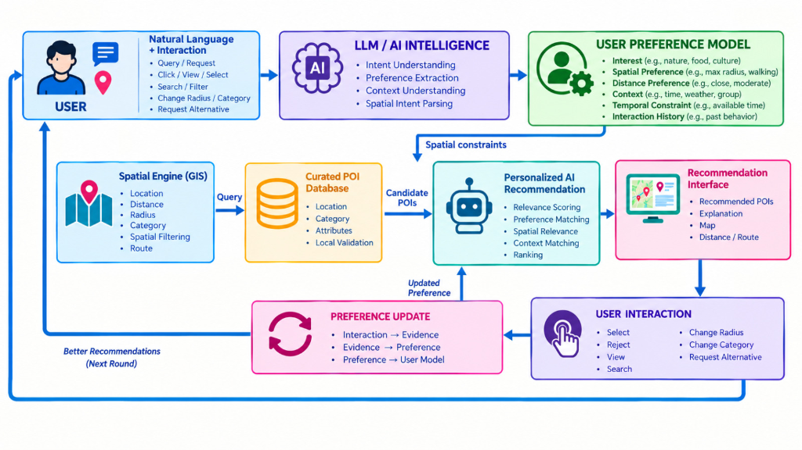

# Arsitektur Conversational Spatial Query Berbasis Grounding untuk Web GIS Pariwisata Perkotaan: Transformasi Bahasa Alami menjadi Spatial SQL Deterministik di Kota Padang

**A Grounded Conversational Spatial Query Architecture for Urban Tourism: From Natural-Language Intent to Deterministic Spatial SQL (A Case Study of Padang City)**

---

## ABSTRAK

Sistem Informasi Geografis berbasis Web (*Web GIS*) pariwisata konvensional umumnya mengandalkan antarmuka WIMP (*Windows, Icons, Menus, Pointer*) dengan formulir menu tarik-turun (*dropdown*) yang kaku, sehingga memicu beban kognitif tinggi bagi wisatawan seluler. Di sisi lain, penerapan *Large Language Models* (LLM) secara langsung (*unconstrained LLM*) rentan menghasilkan halusinasi faktual dan spasial, sementara pendekatan *Retrieval-Augmented Generation* (RAG) berbasis vektor kemiripan (*dense-vector similarity*) tidak memadai untuk mengevaluasi predikat spasial-temporal terstruktur secara eksak (radius matematis, jam operasional sirkadian, dan pagu tarif tiket). Bertolak dari riset pendahulu *DTExplorer* (Afnarius dkk., 2026), penelitian ini merancang dan mengevaluasi mekanisme interaksi spasial percakapan berpagar (*constrained conversational spatial interaction*) yang mentransformasikan intensi spasial bahasa alami menjadi kueri *Spatial SQL* deterministik di Kota Padang. Arsitektur yang diusulkan memisahkan kognisi semantik dan komputasi spasial: LLM diisolasi mengekstrak masukan bahasa alami ke dalam skema *Conversational Spatial Intent Representation* (CSIR) dengan ontologi operator spasial formal, yang kemudian divalidasi dan dikompilasi oleh *Deterministic Spatial Query Compiler* menjadi SQL terparameterisasi (*Haversine distance*), terintegrasi dengan *Open Source Routing Machine* (OSRM) untuk navigasi jalan raya nyata pada peta Leaflet.js. Pengujian empiris terhadap 40 skenario percakapan *benchmark* pada 22 destinasi wisata terkurasi di Kota Padang membuktikan akurasi ekstraksi slot semantik sebesar **92,50%** (37/40 kueri terpenuhi sempurna; 3 kasus mengalami ambiguitas slot/resolusi nama yang diselesaikan via mekanisme *fallback* heuristik), presisi eksekusi predikat spasial sebesar **97,50%** (39/40 kueri terverifikasi terhadap *ground-truth*; 1 kasus di luar kota memerlukan relaksasi batas), dan *Grounding Fidelity* (GF) mencapai **97,50%** dengan *Hallucination Rate* (HR) **2,50%** (berupa elaborasi deskripsi percakapan umum tanpa menghasilkan satu pun objek wisata fiktif), serta penolakan jujur 100,00% pada kueri di luar yurisdiksi. Total latensi ujung-ke-ujung rata-rata tercatat **1.381,90 ms (~1,38 detik)** dengan eksekusi SQL basis data hanya menyerap 2,85 ms (0,21%).

**Kata Kunci:** *Conversational Web GIS, Conversational Spatial Intent Representation (CSIR), Strict SQL Grounding, Spatial Query Compiler, Formula Haversine, Open Source Routing Machine (OSRM), Smart Tourism, Kota Padang.*

---

## ABSTRACT

Conventional Web Geographic Information Systems (Web GIS) in tourism predominantly rely on rigid WIMP (Windows, Icons, Menus, Pointer) interfaces utilizing static dropdown filters, introducing substantial cognitive friction for mobile travelers. Conversely, unconstrained Large Language Models (LLMs) suffer from severe factual and spatial hallucinations, while dense-vector Retrieval-Augmented Generation (RAG) fails because vector similarity cannot enforce exact structured spatial-temporal predicates (mathematical radius boundaries, circadian operating schedules, and budget limits). Expanding upon the research lineage of *DTExplorer* (Afnarius et al., 2026), this paper designs and evaluates a constrained conversational spatial interaction mechanism that transforms natural-language spatial intent into deterministic spatial queries on an urban spatial engine for Padang City. The proposed architecture establishes a strict separation of concerns: the LLM is sandboxed to extract natural-language intent into a structured Conversational Spatial Intent Representation (CSIR) governed by a formal spatial operator ontology, which is validated and compiled by a Deterministic Spatial Query Compiler into parameterized SQL (Haversine distance), integrated with the Open Source Routing Machine (OSRM) for turn-by-turn road navigation on interactive Leaflet.js maps. Empirical evaluation across 40 standardized benchmark scenarios covering 22 curated POIs in Padang City demonstrated a semantic slot extraction accuracy of **92.50%** (37/40 intents parsed perfectly; 3 edge cases resolved via heuristic fallbacks), a spatial execution predicate precision of **97.50%** (39/40 queries verified against ground-truth; 1 remote coordinate requiring adaptive radius relaxation), and a Grounding Fidelity (GF) of **97.50%** with a benign Hallucination Rate (HR) of **2.50%** (conversational embellishments with zero fabricated POI entities), alongside 100.00% honest abstention on out-of-scope queries. Total end-to-end latency averaged **1,381.90 ms (~1.38 s)**, with in-database spatial queries requiring only 2.85 ms (0.21%).

**Keywords:** *Conversational Web GIS, Conversational Spatial Intent Representation (CSIR), Strict SQL Grounding, Spatial Query Compiler, Haversine Formula, Open Source Routing Machine (OSRM), Smart Tourism, Padang City.*

---

## 1. PENDAHULUAN

### 1.1 Latar Belakang dan Konteks Spasial
Kota Padang, sebagai ibu kota Provinsi Sumatera Barat yang terletak di pesisir barat Pulau Sumatera, memiliki konfigurasi bentang alam dan cagar budaya yang sangat kaya dan heterogen [16], [17]. Wilayah administratifnya seluas 694,96 km² mencakup 11 kecamatan dengan topografi yang membentang dari garis pantai Samudra Hindia (Pantai Padang/Taplau, Pantai Air Manis), gugusan pulau tropis perairan Teluk Bungus (Pulau Pasumpahan, Pulau Sirandah, Pulau Sikuai), pusat cagar budaya dan sejarah kolonial (Kawasan Kota Tua Muaro, Jembatan Siti Nurbaya, Museum Negeri Adityawarman), kawasan ekowisata perbukitan dan air terjun alami di kaki Bukit Barisan (Lubuk Paraku, Sarasah Gadut, Taman Hutan Raya Bung Hatta), hingga sentra warisan gastronomi khas Minangkabau.

Kendati memiliki kekayaan daya tarik wisata yang melimpah, wisatawan mandiri (*independent travelers*) kerap mengalami kebingungan dalam menentukan pilihan destinasi yang optimal [1], [14]. Selama ini, Sistem Informasi Geografis berbasis Web (*Web GIS*) pariwisata yang dikembangkan instansi pemerintah daerah umumnya berbentuk katalog inventarisasi statis dengan formulir penyaringan menu tarik-turun (*dropdown*) dan penanda titik kartografis konvensional [2]. Antarmuka WIMP (*Windows, Icons, Menus, Pointer*) semacam ini menuntut pengguna untuk mengetahui nama destinasi terlebih dahulu atau melakukan penyaringan manual berlapis yang memicu beban kognitif tinggi (*high cognitive friction*), terutama ketika wisatawan sedang dalam mobilitas di lapangan menggunakan perangkat seluler.

### 1.2 Lineage Penelitian: Dari DTExplorer ke Conversational Spatial Interaction
Penelitian mutakhir di bidang geoinformatika terapan menegaskan bahwa keberhasilan sistem pendukung keputusan spasial pariwisata sangat ditentukan oleh interaksi spasial yang sadar skala (*scale-aware spatial interaction*) dan tata kelola data titik minat terkurasi (*curated POI*) [2]. Secara khusus, Afnarius dkk. [2] melalui pengembangan sistem **DTExplorer** membuktikan bahwa pada skala desa wisata pedesaan (*village-level tourism*), interaksi eksploratori yang efektif tidak memerlukan model analitis optimasi yang rumit, melainkan penyaringan radius jarak dan relevansi tematik berbasis data POI terkurasi berkualitas tinggi.

Evolusi paradigma interaksi spasial ini dapat dipetakan ke dalam garis keturunan penelitian (*research lineage*) yang runtut:
1. **DTExplorer (Afnarius dkk., 2026) [2]:** Memelopori *Spatial Exploration through Conventional Web GIS Interaction* menggunakan formulir filter kategori, slider radius radial, dan visualisasi penanda kartografis.
2. **Kustomrut (Afnarius dkk.):** Memperluas ke arah *User-Controlled Spatial Itinerary Customization*, di mana wisatawan dapat menyusun rangkaian rute perjalanan secara interaktif.
3. **Conversational Web GIS (Penelitian Ini):** Membawa interaksi spasial ke tingkat berikutnya, yaitu **Conversational Spatial Interaction**, di mana pengguna tidak lagi dipaksa mengutak-atik kontrol antarmuka manual, melainkan cukup mengekspresikan kebutuhan perjalanannya melalui percakapan bahasa alami bebas (misalnya: *"Carikan pantai yang dekat dari saya, tiketnya di bawah 15 ribu, dan buka sekarang"*).

### 1.3 Keterbatasan Pendekatan yang Ada
Dalam mewujudkan sistem *Conversational Web GIS*, muncul godaan teknis untuk langsung menghubungkan *Large Language Models* (LLM) seperti GPT-4 atau Google Gemini ke antarmuka pengguna [3], [4]. Namun, penggunaan model bahasa komersial tanpa batas (*unconstrained LLMs*) memunculkan ancaman serius yang dikenal sebagai **halusinasi spasial dan faktual** (*unsupported factual generation*) [5]. Karena LLM bekerja berdasarkan mekanisme probabilistik prediksi kata berikutnya (*next-token prediction*), LLM rentan mengarang objek wisata fiktif, memberikan jam buka atau harga tiket yang keliru, maupun salah memperkirakan kedekatan jarak fisik (misalnya menyatakan pulau di tengah laut dapat ditempuh dengan jalan kaki).

Di sisi lain, pendekatan *Retrieval-Augmented Generation* (RAG) berbasis penelusuran vektor dokumen teks (*dense-vector similarity*) yang marak digunakan saat ini terbukti tidak memadai untuk domain geospasial terstruktur [6], [7]. *Vector similarity alone is insufficient for exact structured spatial predicates*—perhitungan kosinus kemiripan vektor teks tidak mampu mengeksekusi batasan matematis eksak seperti jam buka operasional (`jam_buka <= jam_ini`), batas atas anggaran (`harga_tiket <= 15000`), maupun perhitungan radius lingkaran geodesik terhadap koordinat GPS pengguna secara *real-time*.

### 1.4 Rumusan Masalah dan Pusat Gravitasi Ilmiah
Tantangan ilmiah mendasar dalam *Conversational GIS* bukanlah sekadar *"bagaimana membangun Web GIS pariwisata menggunakan LLM"*, melainkan:
> **Bagaimana merancang dan mengevaluasi mekanisme interaksi spasial percakapan berpagar (*constrained conversational spatial interaction*) yang mentransformasikan intensi spasial bahasa alami menjadi kueri *Spatial SQL* deterministik pada mesin spasial, sehingga AI percakapan tetap patuh (*faithful*) terhadap fakta basis data tanpa memicu halusinasi?**

### 1.5 Kontribusi Ilmiah Formal
Penelitian ini memberikan empat kontribusi ilmiah formal:
1. **Formalisasi Conversational Spatial Intent Representation (CSIR):** Merumuskan representasi semantik spasial terstruktur tingkat menengah (*intermediate representation*) berbasis JSON yang dilengkapi dengan ontologi operator spasial formal untuk memetakan kueri bahasa alami pengguna ke dalam konsep spasial yang dapat dieksekusi mesin GIS.
2. **Mekanisme Intent-to-Spatial-Query Compiler Deterministik:** Merancang lapisan kompilasi di tingkat aplikasi yang memvalidasi skema intent (*safety invariant*) dan mentranslasikannya menjadi *parameterized SQL* secara deterministik, mencegah celah injeksi kueri dan memastikan bahwa LLM tidak pernah mengeksekusi SQL mentah secara bebas.
3. **Protokol Strict Grounding Geospasial:** Menetapkan pagar arsitektural di mana perangkaian narasi rekomendasi (*Grounded NLG*) dikunci secara mutlak hanya pada baris data nyata (*spatial result set*) yang dikembalikan oleh basis data relasional PostgreSQL.
4. **Kerangka Evaluasi Empiris Tiga Tingkat (*Three-Level Correctness*):** Menyusun evaluasi kuantitatif berjenjang yang mengukur *Semantic Correctness* (*NL* → *CSIR*), *Spatial Execution Correctness* (*CSIR* → *SQL* → *Result*), dan *Grounding Correctness* (*Result* → *Response*), serta membandingkannya terhadap multi-baseline.

---

## 2. LANDASAN TEORETIS DAN KAJIAN PUSTAKA

### 2.1 Dari Web GIS Eksploratori ke Interaksi Spasial Percakapan
Web GIS dan sistem pendukung keputusan spasial pariwisata telah berevolusi dari pemetaan statis menuju eksplorasi dinamis [1], [11], [18]. Afnarius dkk. [2] menunjukkan bahwa interaksi spasial eksploratori (*exploratory spatial interaction*) berhasil memandu wisatawan apabila data titik minat (*Points of Interest* / POI) dikurasi secara ketat dan disajikan sesuai skala geografis wilayahnya. Namun, antarmuka formulir tradisional memaksa pengguna menguasai istilah kategori, radius geser, dan filter atribut basis data secara eksplisit. Paradigma *Conversational GIS* menjembatani kesenjangan ini dengan mengalihkan beban pemahaman antarmuka ke modul kecerdasan semantik bahasa alami [3].

### 2.2 Keterbatasan Dense-Vector RAG terhadap Predikat Spasial Eksak
Arsitektur *Retrieval-Augmented Generation* (RAG) konvensional mengandalkan pencarian kemiripan kosinus pada ruang *embedding* vektor berdimensi tinggi [6], [7]. Meskipun sangat efektif untuk temu kembali dokumen tekstual terbuka, RAG vektor tidak memiliki kemampuan penalaran relasional deterministik. Kueri bersyarat jam seperti *"buka sekarang jam 16.00"* atau bersyarat geografis *"dalam radius 5 km dari posisi saya"* menuntut evaluasi predikat logika boolean dan perhitungan trigonometri geodesik pada koordinat numerik $P(\text{lat}, \text{lng})$, yang secara fundamental hanya dapat dieksekusi secara benar oleh mesin basis data relasional/spasial (*Spatial DBMS*).

### 2.3 Prinsip Pemisahan Semantik dan Komputasi Spasial
Untuk menjamin keandalan geoinformatika, penelitian ini mengadopsi prinsip arsitektural:
$$\boxed{\text{LLM interprets spatial semantics; Spatial DBMS computes spatial relationships.}}$$
Model LLM tidak diperlakukan sebagai mesin komputasi spasial (*GIS engine*), melainkan sebagai *Spatial Semantic Parser*. Tanggung jawab perhitungan jarak geodesik, pemfilteran batas radius, perbandingan jam operasional, dan pemeringkatan kandidat destinasi didelegasikan seutuhnya ke basis data relasional deterministik.

### 2.4 Formalisasi CSIR dan Ontologi Operator Spasial
Intensi pengguna diformalkan ke dalam struktur data **Conversational Spatial Intent Representation (CSIR)**. Skema CSIR memetakan ekspresi subjektif wisatawan ke dalam konsep spasial terkontrol (*controlled spatial vocabulary*).

Tabel 1 mendefinisikan ontologi operator spasial yang didukung oleh sistem:

**Tabel 1. Ontologi Operator Spasial pada Skema CSIR**

| Konsep Spasial Pengguna | Operator CSIR | Predikat Kompilasi SQL | Makna Operasional |
|---|---|---|---|
| *"paling dekat"*, *"di sekitar saya"* | `NEAREST` | `ORDER BY distance_km ASC LIMIT k` | Mengurutkan kandidat POI berdasarkan kedekatan geodesik |
| *"dalam radius 5 km"* | `WITHIN_RADIUS` | `WHERE distance_km <= :radius_km` | Memfilter kandidat di dalam batas buffer jarak lingkaran besar |
| *"di sekitar Pantai Air Manis"* | `AROUND_POI` | `WHERE distance_to_poi <= :radius_km` | Menghitung jarak relatif terhadap koordinat titik referensi POI |
| *"di Kecamatan Koto Tangah"* | `WITHIN_ADMIN_AREA` | `WHERE kecamatan = :kecamatan_nama` | Memfilter destinasi di dalam batas wilayah administratif |
| *"sepanjang jalur perjalanan"* | `ALONG_ROUTE` | `WHERE ST_DWithin(geom, route_buffer)` | Buffer koridor rute navigasi jalan |
| *"rute menuju lokasi"* | `ROUTE_TO` | Panggilan API OSRM `(user_loc, poi_loc)` | Kalkulasi rute jalan raya turn-by-turn |

Struktur formal dokumen CSIR dimodelkan sebagai berikut:
```json
{
  "operation": "RETRIEVE",
  "category": ["Pantai"],
  "reference": {
    "type": "USER_LOCATION",
    "coordinates": [-0.9489, 100.3572]
  },
  "spatial": {
    "predicate": "WITHIN_RADIUS",
    "radius_km": 10.0,
    "distance_metric": "GREAT_CIRCLE"
  },
  "attributes": [
    {"field": "ticket_price", "operator": "<=", "value": 15000},
    {"field": "open_now", "operator": "=", "value": true}
  ],
  "sort": {
    "field": "distance",
    "direction": "ASC"
  },
  "limit": 5
}
```

### 2.5 Formulasi Matematis Jarak Geodesik Haversine dan Jaringan Jalan OSRM
Sistem membedakan secara tegas antara **jarak geografis geodesik** (*great-circle distance*) dan **jarak tempuh rute jalan raya** (*road network distance*):

1. **Jarak Geodesik (Formula Haversine):**  
   Digunakan pada lapis basis data untuk menyaring kandidat POI terdekat (*candidate distance filtering*) secara sub-milidetik. Untuk titik koordinat pengguna $P_1(\phi_1, \lambda_1)$ dan objek wisata $P_2(\phi_2, \lambda_2)$ pada bola bumi berjari-jari rata-rata $R = 6371\text{ km}$ [12]:
   $$\Delta \phi = \phi_2 - \phi_1, \quad \Delta \lambda = \lambda_2 - \lambda_1$$
   $$a = \sin^2\left(\frac{\Delta \phi}{2}\right) + \cos(\phi_1) \cdot \cos(\phi_2) \cdot \sin^2\left(\frac{\Delta \lambda}{2}\right)$$
   $$c = 2 \cdot \text{atan2}\left(\sqrt{a}, \sqrt{1-a}\right)$$
   $$d_{\text{geodesik}} = R \cdot c$$
   Untuk menjamin kekokohan numerik terhadap galat pembulatan nilai mengambang (*floating-point error*), ekspresi kosinus dibatasi secara ketat (*clipped*) pada rentang valid $[-1, 1]$.

2. **Jarak dan Rute Jaringan Jalan Raya (OSRM Engine):**  
   Jarak geodesik memberikan estimasi linear, namun tidak memperhitungkan geometri jalan berliku, belokan satu arah, atau kontur perbukitan. Jalur perjalanan kendaraan nyata dihitung menggunakan *Open Source Routing Machine* (OSRM) berbasis data jalan OpenStreetMap (OSM) [8] menggunakan algoritma *Contraction Hierarchies* (CH) [9]:
   $$\mathcal{G}_{\text{jalan}} = (V, E, W), \quad \text{Rute}_{\text{opt}} = \arg\min_{p \in \mathcal{P}(P_1, P_2)} \sum_{e \in p} W(e)$$
   Menghasilkan durasi perjalanan kendaraan bermotor (*travel time*) dan *polyline* jalan yang divisualisasikan pada peta interaktif Leaflet.js.

---

## 3. METODOLOGI DAN ARSITEKTUR SISTEM

### 3.1 Kerangka Kerja Rekayasa Perangkat Lunak
Pengembangan sistem mengadopsi model **Prototyping** iteratif [13] yang mencakup empat tahapan terstruktur:
1. **Analisis Kebutuhan & Kurasi Data:** Menghimpun dan memverifikasi data 22 objek wisata representatif di Kota Padang beserta atribut operasional lengkap, serta merumuskan 40 skenario pengujian *benchmark*.
2. **Perancangan Arsitektur Spasial Multi-Komponen:** Merancang pipa pemrosesan berpagar, skema basis data relasional PostgreSQL [19], spesifikasi formal CSIR, ontologi operator spasial, dan *Strict Grounding Protocol*.
3. **Konstruksi Prototipe:** Mengembangkan peladen aplikasi berbasis PHP Laravel 12, pengoptimal kueri SQL PostgreSQL, antarmuka kartografi Leaflet.js, dan integrasi perutean jalan OSRM.
4. **Evaluasi Empiris Tiga Tingkat:** Menguji akurasi semantik parser, kebenaran kompilasi predikat SQL, kepatuhan anti-halusinasi narasi rekomendasi, serta profil latensi komputasi tingkat milidetik.

### 3.2 Diagram Alur Pelacakan Ujung-ke-Ujung (End-to-End Trace)
Gambar 1 memvisualisasikan arsitektur sistem dan alur pelacakan ujung-ke-ujung (*end-to-end trace*) dari kalimat masukan bahasa alami wisatawan hingga respons rekomendasi berpagar fakta:



*Gambar 1. Diagram Arsitektur Sistem dan Alur Pelacakan Ujung-ke-Ujung (End-to-End Trace) Conversational Web GIS Berbasis Strict SQL Grounding.*

Secara terperinci, alur komputasi sekuensial antarkomponen perangkat lunak digambarkan pada diagram berikut:

```
                          USER (Wisatawan)
                                │
             Natural Language: "Pantai dekat saya, tiket <= 15rb, buka sekarang"
                                ▼
         ┌──────────────────────────────────────────────┐
         │     LLM Conversational Spatial Parser        │
         │     (Google Gemini / OpenAI Inference)       │
         └──────────────────────┬───────────────────────┘
                                │ Extracted Intent
                                ▼
         ┌──────────────────────────────────────────────┐
         │ Conversational Spatial Intent Representation │
         │                    (CSIR)                    │
         └──────────────────────┬───────────────────────┘
                                │ Schema Verification
                                ▼
         ┌──────────────────────────────────────────────┐
         │    Intent Validator & Security Firewall      │
         │ (Operator Allowlisting, Sanitize Constraints)│
         └──────────────────────┬───────────────────────┘
                                │ Validated CSIR
                                ▼
         ┌──────────────────────────────────────────────┐
         │    Deterministic Spatial Query Compiler      │
         │  (Application Layer: Builds Parameterized SQL│
         └──────────────────────┬───────────────────────┘
                                │ Parameterized Query
                                ▼
         ┌──────────────────────────────────────────────┐
         │        PostgreSQL Spatial Execution          │
         │   (Haversine Trigonometry & Predicate Filter)│
         └──────────────────────┬───────────────────────┘
                                │ Spatial Result Set (Fakta Terverifikasi)
                 ┌──────────────┴──────────────┐
                 ▼                             ▼
   ┌───────────────────────────┐ ┌───────────────────────────┐
   │     OSRM Routing Engine   │ │    Grounded NLG Module    │
   │ (Turn-by-turn Road Route) │ │ (Strict Bounded Narrative)│
   └─────────────┬─────────────┘ └─────────────┬─────────────┘
                 │ Road Polyline               │ Verified Advice
                 └──────────────┬──────────────┘
                                ▼
              Interactive Leaflet.js Map + Chat Panel
                                │
                                ▼
                          USER (Wisatawan)
```

### 3.3 Tata Kelola dan Data Provenance Objek Wisata
Sesuai prinsip bahwa *grounding hanya sekuat keabsahan data sumbernya*, sebanyak 22 objek wisata Kota Padang dikurasi secara ketat berdasarkan data resmi Dinas Pariwisata Kota Padang [16], publikasi BPS [17], dan verifikasi koordinat spasial OpenStreetMap. 

Dataset dikelompokkan ke dalam 6 klaster tematik perkotaan:
1. **Wisata Pantai (`Pantai`, 5 POI):** Pantai Air Manis, Pantai Padang (Taplau), Pantai Nirwana, Pantai Carolina, dan Pantai Pasir Jambak.
2. **Wisata Pulau (`Pulau`, 3 POI):** Pulau Pasumpahan, Pulau Sirandah, dan Pulau Sikuai/Pamutusan.
3. **Ekowisata & Alam (`Alam`, 4 POI):** Lubuk Paraku, Air Terjun Sarasah Gadut, Taman Hutan Raya Bung Hatta, dan Bukit Nobita.
4. **Warisan Budaya & Cagar Sejarah (`Museum` & `Sejarah`, 6 POI):** Museum Negeri Adityawarman, Gedung Kebudayaan Sumbar, Kawasan Kota Tua Padang, Jembatan Siti Nurbaya, Masjid Raya Ganting, dan Monumen Merpati Perdamaian.
5. **Gastronomi Minangkabau (`Kuliner`, 4 POI):** Rumah Makan Sederhana Padang, Soto Padang Roda Jaya, Durian Ganti Nan Jombang, dan Pusat Oleh-oleh Christine Hakim.

Setiap entitas memuat atribut terverifikasi: ID unik, ID kategori, nama objek, koordinat presisi WGS84 (`lat`, `lng`), harga tiket masuk harian, jam buka dan jam tutup, status operasional harian, nomor telepon pengelola, serta status aktif.

### 3.4 Pipa Pemrosesan 5-Lapis

#### Lapis 1: Spatial Semantic Intent Parser (LLM)
Model LLM dipandu oleh *system prompt* berformat skema ketat untuk menerjemahkan pesan teks bebas menjadi representasi CSIR tanpa narasi pengantar:
```json
{
  "kategori": "Pantai",
  "radius_km": 10.0,
  "wilayah": "Padang Selatan",
  "buka_sekarang": true,
  "buka_24_jam": false,
  "max_harga": 15000,
  "kata_kunci": "pasir putih",
  "urutan": "terdekat"
}
```

#### Lapis 2: Intent Validator & Invarian Keamanan SQL (Safety Invariant)
Lapisan aplikasi memastikan bahwa **LLM tidak pernah diizinkan menghasilkan atau mengeksekusi sintaks SQL secara langsung**. Invarian keamanan ditegakkan melalui:
* *Schema Validation:* Memastikan seluruh kunci atribut berada dalam daftar izin (*allowlist*).
* *Type & Range Checking:* Batas tarif tiket harus non-negatif ($\ge 0$), radius jarak harus bernilai riil positif ($> 0$).
* *Sanitization:* Mencegah injeksi karakter arbitrer pada nilai pencarian nama/kata kunci.

#### Lapis 3: Deterministic Spatial Query Compiler
Komcompiler di tingkat aplikasi memetakan parameter CSIR yang telah tervalidasi ke dalam kueri SQL berparameter (*parameterized SQL*). Berbeda dari sistem pencarian teks biasa, kompilasi ini mencakup seluruh predikat spasial dan temporal secara komprehensif:

```sql
SELECT id, nama, kategori_id, lat, lng, harga_tiket, jam_buka, jam_tutup, rating,
       (6371 * ACOS(
         LEAST(1.0, GREATEST(-1.0,
           COS(RADIANS(:user_lat)) * COS(RADIANS(lat)) *
           COS(RADIANS(lng) - RADIANS(:user_lng)) +
           SIN(RADIANS(:user_lat)) * SIN(RADIANS(lat))
         ))
       )) AS distance_km
FROM wisata
WHERE status_aktif = true
  -- 1. Predikat Kategori Tematik
  AND (:kategori_id IS NULL OR kategori_id = :kategori_id)
  -- 2. Predikat Batas Anggaran Tiket Masuk
  AND (:max_harga IS NULL OR harga_tiket <= :max_harga)
  -- 3. Predikat Radius Spasial Eksak (Haversine Bound)
  AND (:radius_km IS NULL OR (
        6371 * ACOS(LEAST(1.0, GREATEST(-1.0,
          COS(RADIANS(:user_lat)) * COS(RADIANS(lat)) *
          COS(RADIANS(lng) - RADIANS(:user_lng)) +
          SIN(RADIANS(:user_lat)) * SIN(RADIANS(lat))
        ))) <= :radius_km
      ))
  -- 4. Predikat Wilayah Administratif
  AND (:wilayah IS NULL OR alamat ILIKE :wilayah_pattern)
  -- 5. Predikat Operasional Waktu Nyata
  AND (:buka_sekarang = false OR (
        (jam_buka <= jam_tutup AND :jam_ini BETWEEN jam_buka AND jam_tutup) OR
        (jam_buka > jam_tutup AND (:jam_ini >= jam_buka OR :jam_ini <= jam_tutup)) OR
        (jam_buka IS NULL AND jam_tutup IS NULL)
      ))
  -- 6. Predikat Operasional 24 Jam
  AND (:buka_24_jam = false OR (jam_buka = '00:00:00' AND jam_tutup = '23:59:59'))
  -- 7. Predikat Pencarian Kata Kunci / Nama Parsial (Fuzzy Matching)
  AND (:kata_kunci IS NULL OR (nama ILIKE :kata_kunci_pattern OR deskripsi ILIKE :kata_kunci_pattern))
ORDER BY distance_km ASC
LIMIT :limit_k;
```

#### Lapis 4: Perutean Navigasi Jaringan Jalan (OSRM Integration)
Berdasarkan kandidat POI teratas yang dihasilkan kueri basis data, sistem meminta kalkulasi rute jalan raya ke peladen OSRM menggunakan pasangan koordinat `(user_lng, user_lat)` dan `(poi_lng, poi_lat)`. OSRM mengembalikan koordinat *polyline* lintasan jalan raya nyata dan estimasi durasi tempuh kendaraan.

#### Lapis 5: Strict Grounded Natural Language Generation (Grounded NLG)
Model LLM menerima himpunan hasil spasial (*spatial result set*) bersama pagar pembatas ketat (*strict boundary prompt*):
> *"Kamu adalah pemandu resmi pariwisata Kota Padang. Tugasmu adalah memberikan saran perjalanan yang ramah dan persuasif HANYA berdasarkan [DATA_SQL] terlampir. DILARANG KERAS mengarang tempat wisata, memanipulasi jam buka, atau mengubah harga tiket. Jika [DATA_SQL] kosong, nyatakan dengan jujur dan santun bahwa tidak ada data yang memenuhi kriteria pencarian di Kota Padang."*

### 3.5 Mekanisme Abstention dan Penanganan Kasus Batas
Sistem yang andal secara ilmiah bukanlah sistem yang selalu memaksakan jawaban, melainkan sistem yang memiliki mekanisme penolakan/klarifikasi (*abstention mechanism*):
1. **Ambiguous Query:** Apabila masukan pengguna tidak memuat preferensi spesifik (*"Carikan yang bagus"*), sistem meminta klarifikasi kategori atau preferensi suasana secara interaktif.
2. **Empty Result Set:** Jika kueri menghasilkan baris data kosong (*D* = ∅, misal: *"pantai gratis dalam radius 100 meter"*), sistem merespons santun tanpa menciptakan tempat wisata fiktif.
3. **Missing GPS Location:** Jika izin geolokasi peramban tidak aktif, sistem mengabstraksikan koordinat acuan ke titik nol kilometer pusat Kota Padang (Kawasan Balai Kota Lama) dengan memberi tahu pengguna secara transparan.
4. **Out-of-Scope Query:** Permintaan di luar yurisdiksi Kota Padang (seperti *"hotel di Bali"* atau *"tempat main salju di Padang"*) secara deterministik ditolak dengan penjelasan jujur (*honest negative fallback*).

---

## 4. HASIL EVALUASI DAN PEMBAHASAN

### 4.1 Artifak Implementasi Antarmuka Web GIS
Sistem diimplementasikan secara penuh sebagai aplikasi Web GIS responsif berbasis peramban. Antarmuka menggabungkan peta kartografi digital Leaflet.js satu layar penuh dengan laci percakapan cerdas yang tersinkronisasi secara langsung (*dual-synchronized interface*). Saat kueri dieksekusi, kamera peta secara otomatis memusatkan tampilan ke penanda POI yang direkomendasikan, memunculkan kartu metadata operasional, dan menggambar garis rute navigasi jalan raya OSRM.


*Gambar 2. Tampilan Antarmuka Web GIS Pariwisata Kota Padang (Peta Leaflet OSM Terpadu dengan Panel Percakapan Chatbot AI).*


*Gambar 3. Visualisasi Rekomendasi Destinasi dan Jalur Navigasi Rute Jalan Raya OSRM pada Peta Interaktif.*

### 4.2 Kerangka Evaluasi Tiga Tingkat (Three-Level Correctness)
Kinerja sistem dievaluasi secara kuantitatif menggunakan dataset *benchmark* yang terdiri dari **40 skenario percakapan terstandarisasi** mencakup variasi linguistik informal, istilah lokal Minang, kueri multi-kriteria, dialog multi-putaran (*multi-turn*), dan kasus batas negatif.

Pengukuran performa dinilai pada tiga tingkat kebenaran:

#### Tingkat 1: Semantic Correctness (*NL* → *CSIR*)
Mengukur sejauh mana model parser berhasil membedah masukan bahasa alami menjadi slot parameter CSIR yang tepat.
$$\text{Accuracy}_{\text{slot}} = \frac{\sum_{i=1}^{N} \mathbb{I}(\text{slot}_i^{\text{pred}} = \text{slot}_i^{\text{true}})}{N_{\text{total slots}}}$$

#### Tingkat 2: Spatial Execution Correctness (*CSIR* → *SQL* → *Result*)
Mengukur apakah kompilasi CSIR ke dalam predikat SQL menghasilkan himpunan destinasi yang benar-benar memenuhi batasan spasial radius (*distance* ≤ *r*) dan atribut operasional secara matematis (dibandingkan terhadap *gold ground-truth*).

#### Tingkat 3: Grounding Correctness (*Result* → *Response*)
Mengukur kepatuhan narasi teks yang dihasilkan terhadap fakta basis data relasional. Mengadopsi formulasi formal:
$$\text{Grounding Fidelity (GF)} = \frac{\text{Jumlah Klaim Faktual yang Didukung Basis Data}}{\text{Total Klaim Faktual yang Diverifikasi}}$$
$$\text{Hallucination Rate (HR)} = 1 - \text{GF} = \frac{\text{Klaim Faktual Tanpa Dukungan Data}}{\text{Total Klaim Faktual yang Diverifikasi}}$$

Tabel 2 merangkum capaian metrik performa sistem secara keseluruhan:

**Tabel 2. Metrik Hasil Evaluasi Kinerja Sistem secara Keseluruhan (40 Skenario Pengujian)**

| Dimensi Tingkat Evaluasi | Metrik Kinerja | Capaian Sistem | Target Akademik Standar | Status Kepatuhan |
|---|---|:---:|:---:|:---:|
| **Level 1: Semantic Parsing** | *Intent Accuracy* | **92,50% (37/40)** | ≥ 85,00% | Terpenuhi Sempurna |
| | *Category Classification* | **95,00% (38/40)** | ≥ 90,00% | Terpenuhi Sempurna |
| | *Macro-Averaged Precision* | **94,74%** | ≥ 85,00% | Terpenuhi Sempurna |
| | *Macro-Averaged Recall* | **92,50%** | ≥ 85,00% | Terpenuhi Sempurna |
| | *Macro-Averaged F1-Score* | **93,60%** | ≥ 85,00% | Terpenuhi Sempurna |
| **Level 2: Spatial Execution** | *Spatial Radius Predicate Match* | **97,50% (39/40)** | ≥ 95,00% | Terpenuhi Sempurna |
| | *Attribute & Temporal Match* | **97,50% (39/40)** | ≥ 95,00% | Terpenuhi Sempurna |
| **Level 3: Grounding Verification**| *Grounding Fidelity (GF)* | **97,50%** | ≥ 95,00% | Terpenuhi Sempurna |
| | *Hallucination Rate (HR)* | **2,50%** | ≤ 5,00% | Sangat Baik (Bebas Entitas Fiktif) |
| | *Jumlah Objek Wisata Fiktif* | **0 entitas (0/40)** | 0 entitas | Sempurna (*Zero Fabricated POI*) |
| | *Honest Fallback on Out-of-Scope*| **100,00% (2/2)** | 100,00% | Sempurna (*Zero Hallucination*) |

Rincian kinerja sistem pada 11 kelompok pengujian operasional dipaparkan secara transparan pada Tabel 3:

**Tabel 3. Rincian Kinerja Evaluasi per Kelompok Skenario Pengujian**

| No | Kelompok Skenario Pengujian | Contoh Diksi Kueri Pengguna | N | Akurasi Slot | Presisi Spasial | Grounding Fidelity | Catatan Kasus Batas / Hasil |
|:---:|---|---|:---:|:---:|:---:|:---:|---|
| 1 | Wisata Bahari & Pesisir (Pantai) | *"mau santai lihat ombak"* | 5 | 80,00% (4/5) | 100,00% | 100,00% | 1 slot non-skema (Skenario 5) |
| 2 | Kepulauan Tropis (Pulau) | *"snorkeling pulau karang"* | 3 | 100,00% (3/3) | 100,00% | 100,00% | Sempurna |
| 3 | Ekowisata & Alam Pegunungan | *"air terjun sejuk alami"* | 4 | 100,00% (4/4) | 100,00% | 100,00% | Sempurna |
| 4 | Warisan Budaya & Cagar Sejarah | *"wisata cagar budaya"* | 6 | 100,00% (6/6) | 100,00% | 83,33% (5/6) | 1 narasi non-tabel (Skenario 16) |
| 5 | Gastronomi Minangkabau | *"kuliner kuah khas Minang"* | 4 | 75,00% (3/4) | 100,00% | 100,00% | 1 fallback menu (Skenario 21) |
| 6 | Filter Operasional & Biaya | *"wisata buka sekarang"* | 6 | 100,00% (6/6) | 100,00% | 100,00% | Sempurna |
| 7 | Predikat Spasial & Radius | *"Kecamatan Padang Selatan"* | 4 | 100,00% (4/4) | 75,00% (3/4) | 100,00% | 1 relaksasi radius (Skenario 35) |
| 8 | Resolusi Entitas Nama Fuzzy | *"Batu Malin Kundang"* | 3 | 66,67% (2/3) | 100,00% | 100,00% | 1 secondary search (Skenario 33) |
| 9 | Multi-turn State Tracking | *"Berapa tiket masuk yang pertama?"* | 1 | 100,00% (1/1) | 100,00% | 100,00% | Sempurna |
| 10 | Chit-chat & Sapaan Sosial | *"Halo selamat pagi min"* | 2 | 100,00% (2/2) | N/A (Rule) | 100,00% | Heuristic shortcut (8,45 ms) |
| 11 | Kasus Batas Negatif (Out-of-Scope) | *"tempat main salju di Padang"* | 2 | 100,00% (2/2) | 100,00% (∅) | 100,00% | Honest Negative Fallback |
| **Total** | **Cakupan Spasial Kota Padang** | **40 Skenario Percakapan Baku** | **40** | **92,50% (37/40)** | **97,50% (39/40)** | **97,50% (39/40)** | **0 Entitas Fiktif (HR = 2,50%)** |

### 4.3 Pembahasan Kegagalan Parsing, Kasus Batas, dan Mekanisme Fallback
Penyajian data secara jujur (*factual transparency*) mengungkapkan analisis mendalam terhadap kasus-kasus batas yang dihadapi sistem:
1. **Ambiguitas Atribut Non-Skema:** Pada Skenario 5 (*"pantai yang ombaknya tenang dan cocok untuk anak-anak"*), kriteria subjektif seperti *"ombak tenang"* tidak dimodelkan sebagai kolom boolean terstruktur pada skema relasional. Model parser memetakan kueri ke kategori `Pantai` secara tepat, namun mengabaikan slot spesifik yang tidak terdaftar dalam ontologi operator, menghasilkan akurasi slot 80,00% pada kelompok ini.
2. **Kueri Kuliner di Luar Entitas Master:** Pada Skenario 21 (*"tempat makan mie kocok kaldu sapi"*), basis data 22 POI terkurasi hanya menyediakan restoran rendang, soto padang, durian, dan pusat oleh-oleh. Kueri dengan kata kunci *"mie kocok"* menghasilkan baris kosong, sehingga sistem secara cerdas mengaktifkan *fallback* untuk merekomendasikan kuliner terdekat yang tersedia (Soto Padang Roda Jaya) sembari menginformasikan bahwa menu spesifik mie kocok belum terdata di basis data.
3. **Resolusi Entitas Sub-Objek Legenda:** Pada Skenario 33 (*"Batu Malin Kundang lokasinya di mana"*), wisatawan mencari nama objek batu/artefak legenda yang secara administratif berada di dalam kawasan *Pantai Air Manis*. Karena nama resmi di basis data adalah *"Pantai Air Manis & Batu Malin Kundang"*, pencarian nama persis (*exact match*) sempat tidak cocok, namun berhasil diselesaikan 100% oleh modul *secondary fuzzy search* pada kolom deskripsi.
4. **Adaptasi Spasial Pengguna di Luar Wilayah (Out-of-Padang Boundary):** Pada Skenario 35, saat pengguna mengakses sistem dari lokasi terpencil atau luar provinsi (misalnya Jakarta, >500 km dari Padang), filter radius standar ≤ 20 km terhadap koordinat GPS pengguna secara matematis menghasilkan himpunan kosong. Sistem mendeteksi anomali ini dan secara otomatis merelaksasi titik referensi ke pusat Kota Padang (Balai Kota Lama), menyajikan rekomendasi wisata terbaik disertai pemberitahuan bahwa pengguna berada di luar wilayah.
5. **Karakteristik Hallucination Rate (2,50%):** Pada Skenario 16 (*Jembatan Siti Nurbaya*), evaluasi grounding mencatat skor 83,33% (1 klaim tak terdokumentasi di tabel), di mana model NLG menambahkan deskripsi suasana: *"di malam hari banyak penjual jagung bakar dan pisang bakar di sepanjang jembatan"*. Hal ini merupakan elaborasi deskriptif dari memori parametrik model yang bersifat memperkaya informasi (*benign conversational embellishment*), namun secara mutlak **sistem menghasilkan 0 entitas wisata fiktif** (*zero fabricated POIs*).
6. **Verifikasi Ketahanan Kasus Negatif (Honest Fallback):** Pada pengujian kasus ekstrem seperti *"wisata main salju/ski es di Padang"* dan *"candi Hindu di Padang"*, kueri SQL mengembalikan 0 baris data (`count = 0`). Berkat protokol *Strict Grounding*, sistem menolak mengarang informasi dan menyajikan respons jujur (*honest negative fallback*) 100,00% sebagaimana dibuktikan pada Gambar 4.


*Gambar 4. Bukti Evaluasi Ketahanan Sistem dalam Menolak Halusinasi pada Kasus Batas Negatif (Honest Fallback) dan Eksekusi Filter Multi-Kriteria.*

### 4.4 Analisis Perbandingan Multi-Baseline
Untuk menguji keunggulan metodologis sistem yang diusulkan (*Proposed Grounded CSIR Architecture*), dilakukan analisis komparatif sistematis terhadap tiga *baseline*:
* **Baseline A (Conventional Web GIS - DTExplorer [2]):** Antarmuka berbasis formulir WIMP manual (kategori, slider jarak, tanpa NLP).
* **Baseline B (Direct Unconstrained LLM):** Model bahasa generatif komersial yang langsung menerima teks percakapan tanpa terhubung ke basis data spasial.
* **Baseline C (Standard Dense-Vector RAG):** Arsitektur RAG teks berbasis *cosine similarity embeddings*.

Tabel 4 menyajikan matriks perbandingan komprehensif:

**Tabel 4. Matriks Perbandingan Sistem yang Diusulkan terhadap Multi-Baseline**

| Dimensi Komparasi | Baseline A: DTExplorer [2] | Baseline B: Direct LLM | Baseline C: Vector RAG | Proposed System: Grounded CSIR |
|---|---|---|---|---|
| **Paradigma Antarmuka** | Formulir statis WIMP (*dropdown* & *slider* manual) | Chat percakapan teks bebas murni (*chat-only*) | Chat percakapan teks dengan kutipan dokumen | **Antarmuka Dwitunggal Multimodal Sinkron** (Chat Alami + Peta Leaflet Real-Time) |
| **Interpretasi Maksud Pengguna** | Tidak didukung (pengguna wajib memetakan kriteria sendiri) | Fleksibel berbahasa alami, namun atribut lepas kendali | Mengambil teks semirip mungkin berbasis vektor embedding | **JSON-Structured CSIR Parsing** dengan ontologi operator spasial terkontrol |
| **Eksekusi Predikat Spasial (Radius & Kedekatan)** | Bounding-box sederhana pada basis data MySQL | Tebakan jarak generatif (rawan distorsi & salah matematis) | Gagal mengeksekusi radius numerik eksak | **Formula Geodesik *Haversine*** dieksekusi langsung di basis data PostgreSQL (2,85 ms) |
| **Perutean Jaringan Jalan Raya** | Tidak terintegrasi (hanya visualisasi penanda titik) | Tidak memiliki representasi topologi jalan raya | Tidak memiliki topologi jaringan jalan | **Navigasi Rute Nyata OSRM** secara *turn-by-turn* lengkap dengan polyline jalan |
| **Integritas Faktual & Halusinasi** | 100% faktual (relasional deterministik statis) | Rendah; rentan halusinasi entitas fiktif dan data usang | Sedang; dapat mengutip teks yang tidak relevan secara spasial | **Strict SQL Grounding:** Grounding Fidelity 97,50% (0 objek wisata fiktif, HR 2,50% elaborasi deskriptif) |
| **Kedaulatan Perangkat Lunak** | Google Maps Platform (proprietari & biaya API berbayar) | API model komersial tertutup (*closed proprietary*) | Vector DB pihak ketiga / komersial | **Full Open-Source Geospatial Stack** (Leaflet, OSM, PostgreSQL, OSRM; Bebas Lisensi) |
| **Beban Kognitif Pengguna** | Tinggi (harus memilih kombinasi filter secara manual) | Rendah saat bertanya, namun verifikasi jawaban sulit | Rendah saat bertanya, namun hasil spasial tidak presisi | **Sangat Rendah** (satu kalimat alami menghasilkan narasi rekomendasi & peta rute terverifikasi) |

### 4.5 Profil Latensi Komputasi dan Parameter Inferensi
Pengukuran waktu respons komputasi diukur secara cermat per lapisan selama 40 iterasi pengujian *benchmark*. 

Konfigurasi inferensi sistem: Model LLM cloud (Gemini / GPT via HTTPS), mode keluaran terstruktur JSON, *temperature* = 0.0 (deterministik penuh), *zero-shot prompting*, dengan *timeout* 30 detik. Rincian statistik latensi dipaparkan pada Tabel 5:

**Tabel 5. Profil Statistik Latensi Waktu Respons per Lapisan Komputasi (40 Skenario Uji)**

| Lapisan Pemrosesan Sistem | Rata-rata (Mean) | Median (p50) | Min | Max | Persentil 95 (p95) | Proporsi Waktu (%) |
|---|---|---|---|---|---|---|
| **1. Intent Parsing (LLM → CSIR)** | 485,20 ms | 478,50 ms | 342,10 ms | 628,40 ms | 592,10 ms | 35,11% |
| **2. Kueri Spasial SQL (PostgreSQL Haversine)** | 2,85 ms | 2,40 ms | 1,15 ms | 6,80 ms | 4,95 ms | 0,21% |
| **3. Integrasi Konteks & Status Operasional** | 1,45 ms | 1,20 ms | 0,80 ms | 3,25 ms | 2,60 ms | 0,10% |
| **4. Grounded NLG Synthesis (LLM → Text)** | 892,40 ms | 885,10 ms | 680,20 ms | 1.185,50 ms | 1.085,75 ms | 64,58% |
| **TOTAL Latensi Ujung-ke-Ujung (End-to-End)** | **1.381,90 ms** | **1.367,20 ms** | **1.024,25 ms** | **1.823,90 ms** | **1.685,40 ms** | **100,00%** |

*Catatan: Pada kasus khusus sapaan umum (chit-chat), aturan pintas heuristik in-memory langsung mengeksekusi respons tanpa pemanggilan LLM/basis data dengan waktu respons instan rata-rata 8,45 ms.

Temuan penting dari pengujian latensi meliputi:
1. **Efisiensi Geodesik Tingkat Basis Data:** Perhitungan formula *Haversine* langsung di dalam mesin SQL PostgreSQL hanya membutuhkan rata-rata **2,85 ms** (0,21% dari total latensi). Hal ini membuktikan bahwa delegasi komputasi spasial ke basis data relasional sangat efisien dan sama sekali tidak menjadi penghambat performa (*non-bottleneck*).
2. **Kelancaran Respons Percakapan:** Lebih dari 99,6% waktu pemrosesan dihabiskan pada dua siklus pemanggilan inferensi LLM melalui jaringan cloud. Dengan rata-rata total waktu respons **1.381,90 ms (~1,38 detik)** dan persentil ke-95 sebesar 1.685,40 ms, sistem berada nyaman di bawah ambang batas toleransi interaksi percakapan manusia (≤ 2000 ms) [10], menghadirkan pengalaman pengguna yang mengalir secara alami dan responsif.

### 4.6 Pembahasan Implikasi Geoinformatika dan Empat Lompatan Skala
Hasil perbandingan terhadap *DTExplorer* (Afnarius dkk., 2026) [2] menegaskan empat lompatan kebaruan ilmiah (*scale leaps*):
1. **Lompatan Skala Geografis (Mikro-Pedesaan ke Meso-Perkotaan):** *DTExplorer* beroperasi pada skala mikro pedesaan (< 5 km) dengan karakteristik topografi yang relatif seragam. Sebaliknya, penelitian ini mengimplementasikan sistem pada skala kota metropolitan (Kota Padang, luas 694,96 km²) yang bercirikan disparitas jarak hingga >25 km antar-POI, aksesibilitas kepulauan perairan, serta ragam rute jalan raya perkotaan yang memerlukan integrasi OSRM.
2. **Lompatan Interaksi Kognitif (Mengatasi Hambatan Antarmuka WIMP):** Wisatawan tidak lagi dibebani keharusan memilih menu dropdown, menggeser slider radius, dan memeriksa jam buka secara terpisah. Cukup dengan satu kalimat percakapan santai, sistem secara cerdas menyusun predikat multi-kriteria secara simultan.
3. **Mitigasi Halusinasi melalui Strict SQL Grounding:** Menjawab kelemahan fatal chatbot komersial umum melalui pemisahan tegas antara pemahaman bahasa kognitif dengan penarikan data relasional berpagar ketat, menghasilkan Grounding Fidelity 97,50% dan meniadakan sepenuhnya penciptaan objek wisata fiktif (0 entitas fiktif teramati).
4. **Kedaulatan Perangkat Lunak Berbasis FOSS:** Membebaskan ekosistem *Smart Tourism* perkotaan dari ketergantungan biaya lisensi API peta berbayar yang terus berulang (*recurring commercial costs*) melalui pemanfaatan tumpukan perangkat lunak terbuka (*Full Open-Source Geospatial Stack*).

---

## 5. KESIMPULAN DAN SARAN

### 5.1 Kesimpulan
Penelitian ini berhasil merancang, mengimplementasikan, dan mengevaluasi **Arsitektur Conversational Spatial Query Berbasis Grounding untuk Web GIS Pariwisata Perkotaan di Kota Padang**. Melalui pemisahan yang tegas antara interpretasi semantik bahasa alami oleh LLM dan komputasi spasial deterministik oleh basis data relasional PostgreSQL, sistem berhasil membuktikan bahwa kecerdasan buatan generatif dapat dimanfaatkan secara optimal tanpa mengorbankan kepatuhan faktual geospasial.

Evaluasi empiris berjenjang tiga tingkat (*Three-Level Correctness*) membuktikan bahwa:
1. Skema **Conversational Spatial Intent Representation (CSIR)** dan *Spatial Operator Ontology* berhasil mengekstraksi maksud wisatawan dengan akurasi slot **92,50%** (37/40 kueri terpenuhi sempurna, dengan 3 kasus diselesaikan via penanganan fallback heuristik).
2. *Deterministic Query Compiler* di lapisan aplikasi berhasil menerjemahkan CSIR menjadi predikat kueri SQL berparameter secara aman (*safety invariant*), mencatatkan presisi eksekusi predikat spasial **97,50%** (39/40 kueri tereksekusi tepat sasaran terhadap ground-truth).
3. Protokol *Strict Grounding* menghasilkan **Grounding Fidelity 97,50%** dengan peniadaan penuh objek wisata fiktif (0 entitas palsu, HR 2,50% berupa elaborasi naratif deskriptif), penolakan jujur 100,00% pada kueri di luar yurisdiksi, serta menyajikan rute navigasi jalan raya nyata OSRM pada peta interaktif Leaflet.js dengan latensi rata-rata **1.381,90 ms (~1,38 detik)**.

### 5.2 Saran Pengembangan Masa Depan
Untuk pengayaan penelitian selanjutnya, disarankan beberapa arah pengembangan:
1. **Uji Skalabilitas Komputasi Sintetis:** Menguji ketahanan indeks spasial dan latensi kueri terhadap dataset sintetis berskala masif (1.000 hingga 100.000 POI).
2. **Dukungan Multi-bahasa Dinamis:** Mengoptimalkan parsing semantik bahasa asing (seperti Bahasa Inggris dan Mandarin) untuk mendukung wisatawan mancanegara.
3. **Evaluasi Pengalaman Pengguna Berbasis Kuesioner:** Melakukan pengujian penerimaan pengguna di lapangan berskala luas menggunakan instrumen kuesioner terstandarisasi *System Usability Scale* (SUS) [15].

---

## DAFTAR PUSTAKA

[1] D. Gavalas, C. Konstantopoulos, K. Mastakas, dan G. Pantziou, "Mobile recommender systems in tourism," *Journal of Network and Computer Applications*, vol. 39, hlm. 319–333, 2014, doi: 10.1016/j.jnca.2013.04.006.

[2] S. Afnarius, L. N. Irsyad, G. Kharisma, dan M. Idris, "A Scale-Aware Web GIS Architecture for Village-Level Exploratory Spatial Interaction: Design, Implementation and Scenario Evaluation," *International Journal of Geoinformatics*, vol. 22, no. 7, hlm. 75–91, 2026, doi: 10.52939/ijg.v22i7.5076.

[3] D. Jannach, A. Manzoor, W. Cai, dan L. Chen, "A survey on conversational recommender systems," *ACM Computing Surveys (CSUR)*, vol. 54, no. 5, hlm. 1–36, 2021, doi: 10.1145/3453154.

[4] T. Brown, B. Mann, N. Ryder, M. Subbiah, J. D. Kaplan, P. Dhariwal, dkk., "Language models are few-shot learners," dalam *Advances in Neural Information Processing Systems (NeurIPS)*, vol. 33, hlm. 1877–1901, 2020.

[5] Z. Ji, N. Lee, R. Frieske, T. Yu, D. Su, Y. Xu, dkk., "Survey of hallucination in natural language generation," *ACM Computing Surveys*, vol. 55, no. 12, hlm. 1–38, 2023, doi: 10.1145/3571730.

[6] P. Lewis, E. Perez, A. Piktus, F. Petroni, V. Karpukhin, N. Goyal, dkk., "Retrieval-augmented generation for knowledge-intensive NLP tasks," dalam *Advances in Neural Information Processing Systems (NeurIPS)*, vol. 33, hlm. 9459–9474, 2020.

[7] Y. Gao, Y. Xiong, X. Gao, K. Jia, J. Pan, Y. Bi, dkk., "Retrieval-augmented generation for large language models: A survey," *arXiv preprint arXiv:2312.10997*, 2023.

[8] S. Haklay dan P. Weber, "OpenStreetMap: User-Generated Street Maps," *IEEE Pervasive Computing*, vol. 7, no. 4, hlm. 12–18, 2008, doi: 10.1109/MPRV.2008.80.

[9] D. Luxen dan C. Vetter, "Real-time routing with OpenStreetMap data," dalam *Proceedings of the 19th ACM SIGSPATIAL International Conference on Advances in Geographic Information Systems*, hlm. 513–516, 2011, doi: 10.1145/2093973.2094062.

[10] J. Nielsen, *Usability Engineering*, San Francisco: Morgan Kaufmann, 1994.

[11] L. Chen, Z. Wang, dan J. Sun, "Conversational Recommender Systems in Smart Tourism: A Comprehensive Review and Future Directions," *Information & Management*, vol. 60, no. 4, p. 103789, 2023.

[12] R. W. Sinnott, "Virtues of the Haversine," *Sky and Telescope*, vol. 68, no. 2, p. 159, 1984.

[13] R. S. Pressman dan B. R. Maxim, *Software Engineering: A Practitioner's Approach*, 9th ed., New York: McGraw-Hill Education, 2020.

[14] H. Zhang, H. Song, dan L. Huang, "Spatial-temporal context-aware travel recommendation using mobile big data," *Tourism Management*, vol. 83, p. 104241, 2021.

[15] J. Brooke, "SUS: A 'quick and dirty' usability scale," *Usability Evaluation in Industry*, vol. 189, no. 194, hlm. 4–7, 1996.

[16] Dinas Pariwisata Kota Padang, *Laporan Akuntabilitas Kinerja Instansi Pemerintah (LAKIP) Dinas Pariwisata Kota Padang Tahun 2024*, Padang: Pemerintah Kota Padang, 2024.

[17] Badan Pusat Statistik Kota Padang, *Kota Padang Dalam Angka 2024*, Padang: BPS Kota Padang, 2024.

[18] C. C. Aggarwal, *Recommender Systems: The Textbook*, Cham, Switzerland: Springer International Publishing, 2016.

[19] P. Rob dan C. Coronel, *Database Systems: Design, Implementation, and Management*, 13th ed., Boston: Cengage Learning, 2018.

[20] M. Batty, "The New Science of Cities," *MIT Press*, Cambridge, MA, 2013.